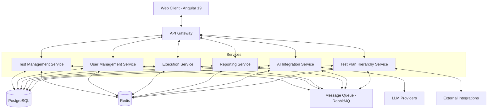
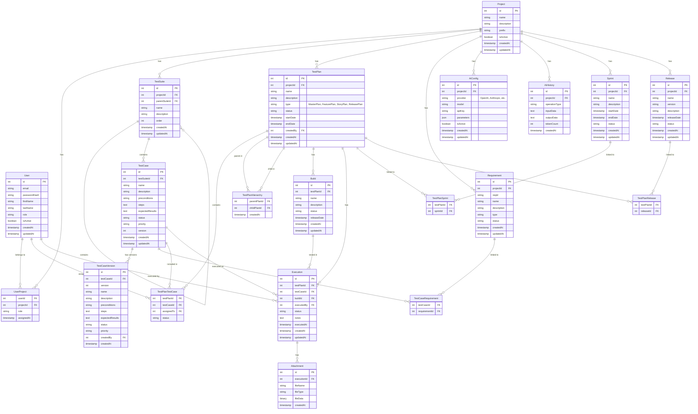

# TECHNICAL SOLUTION DOCUMENT - TESTMASTER

## 1. TỔNG QUAN GIẢI PHÁP KỸ THUẬT

### 1.1 Mục tiêu tài liệu

Tài liệu này cung cấp giải pháp kỹ thuật chi tiết để phát triển hệ thống TestMaster dựa trên Product Requirements Document (PRD) phiên bản 1.0. Tài liệu bao gồm thiết kế kiến trúc, đặc tả kỹ thuật, thiết kế database, API, tích hợp AI, và chiến lược triển khai.

### 1.2 Phạm vi kỹ thuật

Giải pháp kỹ thuật bao gồm:
- Kiến trúc microservices
- Thiết kế database
- Thiết kế API
- Thiết kế frontend
- Tích hợp với LLM và AI Agents
- Cơ chế đảm bảo bảo mật và hiệu suất
- Chiến lược deployment và CI/CD

## 2. KIẾN TRÚC HỆ THỐNG

### 2.1 Kiến trúc tổng thể

TestMaster được thiết kế theo kiến trúc microservices với giao tiếp RESTful và message-based. Kiến trúc này cho phép mở rộng riêng biệt từng thành phần và cung cấp khả năng chịu lỗi cao.



### 2.2 Chi tiết các services

#### 2.2.1 API Gateway
- **Công nghệ:** YARP (Yet Another Reverse Proxy) trên .NET
- **Chức năng:**
  - Định tuyến yêu cầu đến các services phù hợp
  - Xác thực và ủy quyền
  - Rate limiting và throttling
  - Request/response transformation
  - Circuit breaking và retry

#### 2.2.2 Test Management Service
- **Chức năng:**
  - Quản lý Test Project
  - Quản lý Test Suite
  - Quản lý Test Case
  - Quản lý phiên bản Test Case
  - Import/Export Test Case

- **Microservices API Endpoints:**
```
GET /api/v1/projects
POST /api/v1/projects
GET /api/v1/projects/{id}
PUT /api/v1/projects/{id}
DELETE /api/v1/projects/{id}

GET /api/v1/projects/{projectId}/testsuites
POST /api/v1/projects/{projectId}/testsuites
GET /api/v1/testsuites/{id}
PUT /api/v1/testsuites/{id}
DELETE /api/v1/testsuites/{id}

GET /api/v1/testsuites/{suiteId}/testcases
POST /api/v1/testsuites/{suiteId}/testcases
GET /api/v1/testcases/{id}
PUT /api/v1/testcases/{id}
DELETE /api/v1/testcases/{id}
POST /api/v1/testcases/import
GET /api/v1/testcases/export
GET /api/v1/testcases/{id}/versions
GET /api/v1/testcases/{id}/versions/{versionId}
```

#### 2.2.3 User Management Service
- **Chức năng:**
  - Quản lý người dùng và xác thực
  - Quản lý phân quyền và vai trò
  - Single Sign-On (SSO)
  - Xác thực hai yếu tố (2FA)
  - Theo dõi hoạt động người dùng (Audit)

- **Microservices API Endpoints:**
```
POST /api/v1/auth/register
POST /api/v1/auth/login
POST /api/v1/auth/logout
POST /api/v1/auth/refresh-token
POST /api/v1/auth/setup-2fa
POST /api/v1/auth/verify-2fa

GET /api/v1/users
POST /api/v1/users
GET /api/v1/users/{id}
PUT /api/v1/users/{id}
DELETE /api/v1/users/{id}
GET /api/v1/users/{id}/activity
GET /api/v1/roles
POST /api/v1/roles
```

#### 2.2.4 Execution Service
- **Chức năng:**
  - Thực thi Test Case
  - Ghi nhận kết quả
  - Đính kèm ảnh chụp và ghi chú
  - Theo dõi thời gian thực thi
  - Liên kết với Bug Tracking System

- **Microservices API Endpoints:**
```
POST /api/v1/executions
GET /api/v1/executions/{id}
PUT /api/v1/executions/{id}
GET /api/v1/testplans/{planId}/executions
POST /api/v1/executions/{id}/attachments
GET /api/v1/executions/{id}/attachments
DELETE /api/v1/executions/{id}/attachments/{attachmentId}
```

#### 2.2.5 Reporting Service
- **Chức năng:**
  - Tạo báo cáo động
  - Dashboard visualization
  - Xuất báo cáo (PDF, Excel, HTML)
  - Phân tích xu hướng và chỉ số
  - Cảnh báo rủi ro

- **Microservices API Endpoints:**
```
GET /api/v1/reports/testplans/{planId}/summary
GET /api/v1/reports/testplans/{planId}/detailed
GET /api/v1/reports/sprints/{sprintId}/summary
GET /api/v1/reports/releases/{releaseId}/summary
GET /api/v1/reports/custom
POST /api/v1/reports/export
GET /api/v1/dashboards/{dashboardId}
POST /api/v1/dashboards
PUT /api/v1/dashboards/{dashboardId}
```

#### 2.2.6 AI Integration Service
- **Chức năng:**
  - Tích hợp với LLM providers
  - Xử lý và phân đoạn SRS
  - Quản lý các AI prompt
  - Tạo Test Case tự động
  - Phân tích lỗi và đề xuất giải pháp

- **Microservices API Endpoints:**
```
POST /api/v1/ai/analyze-srs
POST /api/v1/ai/generate-testcases
GET /api/v1/ai/providers
POST /api/v1/ai/providers/{providerId}/test
GET /api/v1/ai/prompts
POST /api/v1/ai/prompts
PUT /api/v1/ai/prompts/{id}
DELETE /api/v1/ai/prompts/{id}
GET /api/v1/ai/history
GET /api/v1/ai/history/{id}
```

#### 2.2.7 Test Plan Hierarchy Service
- **Chức năng:**
  - Quản lý cấu trúc phân cấp Test Plan
  - Liên kết giữa các cấp Test Plan
  - Tổng hợp và cập nhật trạng thái
  - Quản lý Sprint/Release
  - Phân công Test Case

- **Microservices API Endpoints:**
```
GET /api/v1/testplans
POST /api/v1/testplans
GET /api/v1/testplans/{id}
PUT /api/v1/testplans/{id}
DELETE /api/v1/testplans/{id}

GET /api/v1/testplans/{id}/hierarchy
PUT /api/v1/testplans/{id}/hierarchy
POST /api/v1/testplans/{id}/link
DELETE /api/v1/testplans/{id}/link/{linkedPlanId}

GET /api/v1/testplans/{planId}/assignments
POST /api/v1/testplans/{planId}/assignments
DELETE /api/v1/testplans/{planId}/assignments/{assignmentId}

GET /api/v1/sprints
POST /api/v1/sprints
GET /api/v1/releases
POST /api/v1/releases
```

### 2.3 Communication Patterns

#### 2.3.1 Synchronous Communication
- RESTful API cho tương tác người dùng trực tiếp
- gRPC cho tương tác giữa các microservices cần độ trễ thấp

#### 2.3.2 Asynchronous Communication
- RabbitMQ cho các hoạt động không đồng bộ:
  - Tạo Test Case tự động từ SRS (thời gian dài)
  - Cập nhật trạng thái giữa các Test Plan phân cấp
  - Tổng hợp báo cáo Release Plan
  - Đồng bộ hóa với hệ thống bên ngoài

- Event types:
  ```
  TestCaseCreated
  TestCaseUpdated
  TestCaseDeleted
  TestExecutionCompleted
  TestPlanStatusChanged
  SrsAnalysisCompleted
  LlmTestCasesGenerated
  ```

## 3. THIẾT KẾ DATABASE

### 3.1 Entity-Relationship Diagram (ERD)



### 3.2 Indexing Strategy

#### 3.2.1 Key Indexes
- Primary keys và Foreign keys sẽ có index tự động
- Compound indexes cho các trường tìm kiếm phổ biến:
  - `IX_TestCase_Name_Status`: Tối ưu tìm kiếm test case theo tên và trạng thái
  - `IX_Execution_TestPlanId_Status`: Tối ưu báo cáo thực thi theo test plan
  - `IX_TestPlanTestCase_TestPlanId_Status`: Tối ưu hiển thị trạng thái test plan
  - `IX_AiHistory_ProjectId_CreatedAt`: Tối ưu truy vấn lịch sử AI theo project

#### 3.2.2 Full-Text Search
- Postgre Full-Text Search cho tìm kiếm test case và requirement
- Tạo tsvector columns và GIN indexes:
  ```sql
  ALTER TABLE TestCase ADD COLUMN search_vector tsvector;
  CREATE INDEX idx_fts_test_case ON TestCase USING GIN (search_vector);
  
  CREATE FUNCTION test_case_search_trigger() RETURNS trigger AS $$
  BEGIN
    NEW.search_vector := 
      setweight(to_tsvector('english', coalesce(NEW.name, '')), 'A') ||
      setweight(to_tsvector('english', coalesce(NEW.description, '')), 'B') ||
      setweight(to_tsvector('english', coalesce(NEW.steps, '')), 'C') ||
      setweight(to_tsvector('english', coalesce(NEW.expectedResults, '')), 'D');
    RETURN NEW;
  END
  $$ LANGUAGE plpgsql;
  
  CREATE TRIGGER tsvector_update_trigger
  BEFORE INSERT OR UPDATE ON TestCase
  FOR EACH ROW EXECUTE FUNCTION test_case_search_trigger();
  ```

### 3.3 Caching Strategy

#### 3.3.1 Redis Cache Structure
- **Cache Keys:**
  - `project:{projectId}`: Thông tin project
  - `testplan:{planId}:summary`: Tóm tắt test plan
  - `testplan:{planId}:status`: Trạng thái test plan
  - `testcase:{caseId}`: Thông tin test case
  - `dashboard:{userId}:recent`: Dashboard gần đây theo người dùng
  - `sprint:{sprintId}:status`: Trạng thái sprint
  - `release:{releaseId}:status`: Trạng thái release

- **Cache TTL:**
  - Thông tin tĩnh: 1 ngày
  - Dashboard data: 15 phút
  - Trạng thái Test Plan: 5 phút

#### 3.3.2 Cache Invalidation
- **Event-based invalidation:**
  - Sau khi Execution hoàn thành, invalidate các cache liên quan
  - Sau khi Test Case thay đổi, invalidate các cache của Test Plan chứa nó
  - Sử dụng RabbitMQ để phát hành sự kiện cache invalidation

```csharp
// Sample code for cache invalidation
public async Task InvalidateTestPlanCache(int testPlanId)
{
    await _cacheService.RemoveAsync($"testplan:{testPlanId}:summary");
    await _cacheService.RemoveAsync($"testplan:{testPlanId}:status");
    
    // Get all parent test plans and invalidate
    var parentPlans = await _testPlanHierarchyRepository.GetParentPlans(testPlanId);
    foreach (var parentId in parentPlans)
    {
        await _cacheService.RemoveAsync($"testplan:{parentId}:summary");
        await _cacheService.RemoveAsync($"testplan:{parentId}:status");
    }
    
    // Publish event for dashboard cache invalidation
    await _messageBus.PublishAsync(new TestPlanChangedEvent { TestPlanId = testPlanId });
}
```

## 4. THIẾT KẾ FRONTEND

### 4.1 Cấu trúc module Angular

```
app/
|-- core/                      # Core functionality
|   |-- auth/                  # Authentication
|   |-- http/                  # HTTP Interceptors
|   |-- guards/                # Route Guards
|   |-- services/              # Global Services
|   |-- models/                # Data Models
|   `-- store/                 # NgRx Store
|
|-- shared/                    # Shared components & utilities
|   |-- components/            # Reusable components
|   |-- directives/            # Custom directives
|   |-- pipes/                 # Custom pipes
|   `-- utils/                 # Utility functions
|
|-- features/                  # Feature modules
|   |-- dashboard/             # Dashboard feature
|   |-- projects/              # Projects management
|   |-- test-suites/           # Test Suites management
|   |-- test-cases/            # Test Cases management
|   |-- test-plans/            # Test Plans management
|   |-- executions/            # Test Executions
|   |-- reports/               # Reports & analytics
|   `-- ai-integration/        # AI Integration features
|
|-- layouts/                   # Layout components
|   |-- main-layout/           # Main application layout
|   |-- auth-layout/           # Authentication layout
|   `-- error-layout/          # Error pages layout
|
`-- app.module.ts              # Root module
```

### 4.2 State Management (NgRx)

#### 4.2.1 Store Structure

```
store/
|-- index.ts                   # Root state & reducers
|-- app.state.ts               # App state interface
|-- auth/                      # Auth state
|   |-- auth.actions.ts
|   |-- auth.reducer.ts
|   |-- auth.selectors.ts
|   |-- auth.effects.ts
|   `-- auth.state.ts
|
|-- projects/                  # Projects state
|-- test-cases/                # Test Cases state
|-- test-plans/                # Test Plans state
|-- executions/                # Executions state
`-- ai/                        # AI state
```

#### 4.2.2 Mẫu NgRx Store (ví dụ với Test Plan)

```typescript
// test-plans.state.ts
export interface TestPlanState {
  testPlans: TestPlan[];
  selectedTestPlan: TestPlan | null;
  hierarchyView: TestPlanHierarchyNode[] | null;
  loading: boolean;
  loaded: boolean;
  error: string | null;
}

// test-plans.actions.ts
export const loadTestPlans = createAction('[Test Plans] Load Test Plans', props<{ projectId: number }>());
export const loadTestPlansSuccess = createAction('[Test Plans] Load Test Plans Success', props<{ testPlans: TestPlan[] }>());
export const loadTestPlansFailure = createAction('[Test Plans] Load Test Plans Failure', props<{ error: any }>());

export const loadTestPlanHierarchy = createAction('[Test Plans] Load Hierarchy', props<{ testPlanId: number }>());
export const loadTestPlanHierarchySuccess = createAction('[Test Plans] Load Hierarchy Success', props<{ hierarchy: TestPlanHierarchyNode[] }>());
export const loadTestPlanHierarchyFailure = createAction('[Test Plans] Load Hierarchy Failure', props<{ error: any }>());

// test-plans.reducer.ts
const initialState: TestPlanState = {
  testPlans: [],
  selectedTestPlan: null,
  hierarchyView: null,
  loading: false,
  loaded: false,
  error: null
};

export const testPlanReducer = createReducer(
  initialState,
  on(loadTestPlans, (state) => ({ ...state, loading: true, error: null })),
  on(loadTestPlansSuccess, (state, { testPlans }) => ({ ...state, testPlans, loading: false, loaded: true })),
  on(loadTestPlansFailure, (state, { error }) => ({ ...state, error, loading: false })),
  
  on(loadTestPlanHierarchy, (state) => ({ ...state, loading: true, error: null })),
  on(loadTestPlanHierarchySuccess, (state, { hierarchy }) => ({ ...state, hierarchyView: hierarchy, loading: false })),
  on(loadTestPlanHierarchyFailure, (state, { error }) => ({ ...state, error, loading: false }))
);

// test-plans.effects.ts
@Injectable()
export class TestPlanEffects {
  loadTestPlans$ = createEffect(() => this.actions$.pipe(
    ofType(loadTestPlans),
    switchMap(({ projectId }) => this.testPlanService.getTestPlans(projectId).pipe(
      map(testPlans => loadTestPlansSuccess({ testPlans })),
      catchError(error => of(loadTestPlansFailure({ error: error.message })))
    ))
  ));
  
  loadTestPlanHierarchy$ = createEffect(() => this.actions$.pipe(
    ofType(loadTestPlanHierarchy),
    switchMap(({ testPlanId }) => this.testPlanService.getHierarchy(testPlanId).pipe(
      map(hierarchy => loadTestPlanHierarchySuccess({ hierarchy })),
      catchError(error => of(loadTestPlanHierarchyFailure({ error: error.message })))
    ))
  ));
  
  constructor(
    private actions$: Actions,
    private testPlanService: TestPlanService
  ) {}
}
```

### 4.3 Responsive UI Components

#### 4.3.1 Dashboard Components

```typescript
@Component({
  selector: 'app-test-plan-dashboard',
  templateUrl: './test-plan-dashboard.component.html',
  styleUrls: ['./test-plan-dashboard.component.scss']
})
export class TestPlanDashboardComponent implements OnInit {
  testPlanSummary$: Observable<TestPlanSummary> = this.store.select(selectTestPlanSummary);
  statusDistribution$: Observable<StatusDistribution> = this.store.select(selectStatusDistribution);
  
  // Chart options for status distribution
  statusChartOptions: ChartOptions = {
    responsive: true,
    maintainAspectRatio: false,
    plugins: {
      legend: {
        position: 'right',
        labels: {
          boxWidth: 12
        }
      }
    }
  };
  
  constructor(private store: Store) {}
  
  ngOnInit(): void {
    this.store.dispatch(loadTestPlanSummary({ testPlanId: this.activatedRoute.snapshot.params.id }));
    this.store.dispatch(loadStatusDistribution({ testPlanId: this.activatedRoute.snapshot.params.id }));
  }
}
```

#### 4.3.2 Test Plan Hierarchy Component

```typescript
@Component({
  selector: 'app-test-plan-hierarchy',
  templateUrl: './test-plan-hierarchy.component.html',
  styleUrls: ['./test-plan-hierarchy.component.scss']
})
export class TestPlanHierarchyComponent implements OnInit {
  @Input() testPlanId: number;
  hierarchy$: Observable<TestPlanHierarchyNode[]> = this.store.select(selectTestPlanHierarchy);
  loading$: Observable<boolean> = this.store.select(selectTestPlanHierarchyLoading);
  
  // Tree control for Material CDK
  treeControl = new NestedTreeControl<TestPlanHierarchyNode>(node => node.children);
  dataSource = new MatTreeNestedDataSource<TestPlanHierarchyNode>();
  
  constructor(private store: Store) {}
  
  ngOnInit(): void {
    this.store.dispatch(loadTestPlanHierarchy({ testPlanId: this.testPlanId }));
    
    this.hierarchy$.pipe(
      filter(hierarchy => !!hierarchy)
    ).subscribe(hierarchy => {
      this.dataSource.data = hierarchy;
      this.treeControl.expandAll();
    });
  }
  
  hasChild = (_: number, node: TestPlanHierarchyNode) => 
    !!node.children && node.children.length > 0;
    
  getStatusClass(status: string): string {
    switch(status.toLowerCase()) {
      case 'passed': return 'status-passed';
      case 'failed': return 'status-failed';
      case 'blocked': return 'status-blocked';
      case 'not run': return 'status-not-run';
      default: return '';
    }
  }
}
```

### 4.4 Lazy Loading Strategy

```typescript
// app-routing.module.ts
const routes: Routes = [
  {
    path: '',
    component: MainLayoutComponent,
    canActivate: [AuthGuard],
    children: [
      {
        path: 'dashboard',
        loadChildren: () => import('./features/dashboard/dashboard.module').then(m => m.DashboardModule)
      },
      {
        path: 'projects',
        loadChildren: () => import('./features/projects/projects.module').then(m => m.ProjectsModule)
      },
      {
        path: 'test-suites',
        loadChildren: () => import('./features/test-suites/test-suites.module').then(m => m.TestSuitesModule)
      },
      {
        path: 'test-cases',
        loadChildren: () => import('./features/test-cases/test-cases.module').then(m => m.TestCasesModule)
      },
      {
        path: 'test-plans',
        loadChildren: () => import('./features/test-plans/test-plans.module').then(m => m.TestPlansModule)
      },
      {
        path: 'executions',
        loadChildren: () => import('./features/executions/executions.module').then(m => m.ExecutionsModule)
      },
      {
        path: 'reports',
        loadChildren: () => import('./features/reports/reports.module').then(m => m.ReportsModule)
      },
      {
        path: 'ai-integration',
        loadChildren: () => import('./features/ai-integration/ai-integration.module').then(m => m.AiIntegrationModule)
      }
    ]
  },
  {
    path: 'auth',
    component: AuthLayoutComponent,
    loadChildren: () => import('./features/auth/auth.module').then(m => m.AuthModule)
  },
  {
    path: 'error',
    component: ErrorLayoutComponent,
    loadChildren: () => import('./features/error/error.module').then(m => m.ErrorModule)
  }
];
```

## 5. AI INTEGRATION

### 5.1 Tích hợp với LLM Providers

#### 5.1.1 Provider Abstraction Layer

```csharp
// Interface cho LLM providers
public interface ILlmProvider
{
    Task<LlmResponse> GenerateCompletionAsync(string prompt, LlmRequestOptions options);
    Task<bool> TestConnectionAsync();
    string ProviderName { get; }
    IEnumerable<string> AvailableModels { get; }
}

// Implementation cho OpenAI
public class OpenAiProvider : ILlmProvider
{
    private readonly OpenAIClient _client;
    private readonly ILogger<OpenAiProvider> _logger;
    
    public OpenAiProvider(string apiKey, ILogger<OpenAiProvider> logger)
    {
        _client = new OpenAIClient(apiKey);
        _logger = logger;
    }
    
    public string ProviderName => "OpenAI";
    
    public IEnumerable<string> AvailableModels => new[] { "gpt-4", "gpt-4-turbo", "gpt-3.5-turbo" };
    
    public async Task<LlmResponse> GenerateCompletionAsync(string prompt, LlmRequestOptions options)
    {
        try {
            var completionOptions = new CompletionOptions
            {
                Model = options.Model ?? "gpt-4",
                MaxTokens = options.MaxTokens ?? 2000,
                Temperature = options.Temperature ?? 0.2f,
                Messages = new[] {
                    new Message(Role.System, options.SystemPrompt),
                    new Message(Role.User, prompt)
                }
            };
            
            var response = await _client.GetCompletionAsync(completionOptions);
            
            return new LlmResponse
            {
                Content = response.Choices[0].Message.Content,
                TokensUsed = response.Usage.TotalTokens,
                IsSuccessful = true
            };
        }
        catch (Exception ex)
        {
            _logger.LogError(ex, "Error generating completion from OpenAI");
            return new LlmResponse
            {
                IsSuccessful = false,
                ErrorMessage = ex.Message
            };
        }
    }
    
    public async Task<bool> TestConnectionAsync()
    {
        try {
            var response = await _client.GetCompletionAsync(new CompletionOptions
            {
                Model = "gpt-3.5-turbo",
                Messages = new[] { new Message(Role.User, "Hello") },
                MaxTokens = 5
            });
            
            return response != null;
        }
        catch {
            return false;
        }
    }
}

// Tương tự implementation cho Anthropic Claude
public class ClaudeProvider : ILlmProvider
{
    // Implementation tương tự
}
```

#### 5.1.2 Document Processing & Chunking

```csharp
public class DocumentProcessor
{
    private readonly ILogger<DocumentProcessor> _logger;
    
    public DocumentProcessor(ILogger<DocumentProcessor> logger)
    {
        _logger = logger;
    }
    
    public async Task<List<DocumentChunk>> ProcessDocumentAsync(Stream documentStream, string fileType)
    {
        var content = await ExtractTextContent(documentStream, fileType);
        return ChunkDocument(content);
    }
    
    private async Task<string> ExtractTextContent(Stream documentStream, string fileType)
    {
        switch (fileType.ToLowerInvariant())
        {
            case "pdf":
                return await ExtractFromPdf(documentStream);
            case "docx":
                return await ExtractFromDocx(documentStream);
            case "markdown":
            case "md":
                return await ExtractFromMarkdown(documentStream);
            default:
                throw new NotSupportedException($"File type {fileType} is not supported");
        }
    }
    
    private List<DocumentChunk> ChunkDocument(string content)
    {
        var sections = new List<DocumentChunk>();
        
        // Identify document structure (headings, sections)
        var matches = Regex.Matches(content, @"(?<heading>#{1,6}\s+.+)|(?<section>.+?)(?=#{1,6}\s+|$)", RegexOptions.Singleline);
        
        string currentHeading = "";
        StringBuilder currentSection = new StringBuilder();
        
        foreach (Match match in matches)
        {
            if (match.Groups["heading"].Success)
            {
                // If we have content in currentSection, add it as a chunk
                if (currentSection.Length > 0)
                {
                    sections.Add(new DocumentChunk
                    {
                        Heading = currentHeading,
                        Content = currentSection.ToString().Trim(),
                        Type = "section"
                    });
                    currentSection.Clear();
                }
                
                currentHeading = match.Groups["heading"].Value.Trim();
                sections.Add(new DocumentChunk
                {
                    Heading = currentHeading,
                    Content = currentHeading,
                    Type = "heading"
                });
            }
            else if (match.Groups["section"].Success)
            {
                string sectionText = match.Groups["section"].Value.Trim();
                if (!string.IsNullOrWhiteSpace(sectionText))
                {
                    currentSection.AppendLine(sectionText);
                }
            }
        }
        
        // Add the last section if any
        if (currentSection.Length > 0)
        {
            sections.Add(new DocumentChunk
            {
                Heading = currentHeading,
                Content = currentSection.ToString().Trim(),
                Type = "section"
            });
        }
        
        // Further chunk large sections to respect token limits
        return ChunkLargeSections(sections);
    }
    
    private List<DocumentChunk> ChunkLargeSections(List<DocumentChunk> sections)
    {
        var result = new List<DocumentChunk>();
        
        foreach (var section in sections)
        {
            if (section.Type == "heading" || EstimateTokens(section.Content) <= 1500)
            {
                result.Add(section);
                continue;
            }
            
            // Split large sections into paragraphs
            var paragraphs = Regex.Split(section.Content, @"(?<=\n\n)").Where(p => !string.IsNullOrWhiteSpace(p)).ToList();
            
            StringBuilder currentChunk = new StringBuilder();
            int chunkIndex = 1;
            
            foreach (var paragraph in paragraphs)
            {
                if (EstimateTokens(currentChunk.ToString() + paragraph) > 1500)
                {
                    if (currentChunk.Length > 0)
                    {
                        result.Add(new DocumentChunk
                        {
                            Heading = $"{section.Heading} (Part {chunkIndex})",
                            Content = currentChunk.ToString().Trim(),
                            Type = "section"
                        });
                        chunkIndex++;
                        currentChunk.Clear();
                    }
                }
                
                currentChunk.AppendLine(paragraph);
            }
            
            if (currentChunk.Length > 0)
            {
                result.Add(new DocumentChunk
                {
                    Heading = chunkIndex > 1 ? $"{section.Heading} (Part {chunkIndex})" : section.Heading,
                    Content = currentChunk.ToString().Trim(),
                    Type = "section"
                });
            }
        }
        
        return result;
    }
    
    private int EstimateTokens(string text)
    {
        // Rough estimation: 1 token ≈ 4 characters for English text
        return text.Length / 4;
    }
}
```

#### 5.1.3 Test Case Generation Service

```csharp
public class TestCaseGenerationService
{
    private readonly ILlmProviderFactory _llmProviderFactory;
    private readonly IPromptTemplateRepository _promptRepository;
    private readonly ITestCaseRepository _testCaseRepository;
    private readonly DocumentProcessor _documentProcessor;
    private readonly ILogger<TestCaseGenerationService> _logger;
    
    public TestCaseGenerationService(
        ILlmProviderFactory llmProviderFactory,
        IPromptTemplateRepository promptRepository,
        ITestCaseRepository testCaseRepository,
        DocumentProcessor documentProcessor,
        ILogger<TestCaseGenerationService> logger)
    {
        _llmProviderFactory = llmProviderFactory;
        _promptRepository = promptRepository;
        _testCaseRepository = testCaseRepository;
        _documentProcessor = documentProcessor;
        _logger = logger;
    }
    
    public async Task<TestCaseGenerationResult> GenerateTestCasesFromSrsAsync(
        int projectId,
        Stream srsDocument,
        string fileType,
        string llmProvider,
        string llmModel,
        CancellationToken cancellationToken = default)
    {
        try
        {
            // 1. Process document into chunks
            var chunks = await _documentProcessor.ProcessDocumentAsync(srsDocument, fileType);
            
            // 2. Get appropriate prompt template
            var promptTemplate = await _promptRepository.GetTestCasePromptTemplateAsync(projectId);
            if (promptTemplate == null)
            {
                promptTemplate = await _promptRepository.GetDefaultTestCasePromptTemplateAsync();
            }
            
            // 3. Initialize LLM provider
            var provider = _llmProviderFactory.CreateProvider(llmProvider);
            
            // 4. Process each chunk to identify requirements
            var requirementsPrompt = promptTemplate.RequirementsExtractionPrompt;
            var requirements = new List<RequirementDto>();
            
            foreach (var chunk in chunks.Where(c => c.Type == "section"))
            {
                if (cancellationToken.IsCancellationRequested)
                    break;
                
                var prompt = requirementsPrompt.Replace("{DOCUMENT_CHUNK}", chunk.Content);
                
                var response = await provider.GenerateCompletionAsync(prompt, new LlmRequestOptions
                {
                    Model = llmModel,
                    SystemPrompt = promptTemplate.SystemPrompt,
                    Temperature = 0.2f,
                    MaxTokens = 2000
                });
                
                if (response.IsSuccessful)
                {
                    var extractedRequirements = ParseRequirementsFromLlmResponse(response.Content);
                    requirements.AddRange(extractedRequirements);
                }
            }
            
            // 5. Generate test cases from requirements
            var testCasePrompt = promptTemplate.TestCaseGenerationPrompt;
            var testCases = new List<TestCaseDto>();
            
            foreach (var requirement in requirements)
            {
                if (cancellationToken.IsCancellationRequested)
                    break;
                
                var prompt = testCasePrompt
                    .Replace("{REQUIREMENT_ID}", requirement.Id)
                    .Replace("{REQUIREMENT_DESCRIPTION}", requirement.Description)
                    .Replace("{REQUIREMENT_DETAILS}", requirement.Details);
                
                var response = await provider.GenerateCompletionAsync(prompt, new LlmRequestOptions
                {
                    Model = llmModel,
                    SystemPrompt = promptTemplate.SystemPrompt,
                    Temperature = 0.7f,
                    MaxTokens = 4000
                });
                
                if (response.IsSuccessful)
                {
                    var generatedTestCases = ParseTestCasesFromLlmResponse(response.Content, requirement.Id);
                    testCases.AddRange(generatedTestCases);
                }
            }
            
            return new TestCaseGenerationResult
            {
                IsSuccessful = true,
                Requirements = requirements,
                TestCases = testCases
            };
        }
        catch (Exception ex)
        {
            _logger.LogError(ex, "Error generating test cases from SRS");
            return new TestCaseGenerationResult
            {
                IsSuccessful = false,
                ErrorMessage = ex.Message
            };
        }
    }
    
    private List<RequirementDto> ParseRequirementsFromLlmResponse(string response)
    {
        var requirements = new List<RequirementDto>();
        
        // Parse structured output from LLM
        // This is a simple implementation, might need improvement based on actual LLM output
        
        var matches = Regex.Matches(response, @"ID:\s*([^\n]+)\s*\nMô tả:\s*([^\n]+)\s*\nChi tiết:\s*([^\n]+)\s*\nLoại:\s*([^\n]+)");
        
        foreach (Match match in matches)
        {
            requirements.Add(new RequirementDto
            {
                Id = match.Groups[1].Value.Trim(),
                Description = match.Groups[2].Value.Trim(),
                Details = match.Groups[3].Value.Trim(),
                Type = match.Groups[4].Value.Trim()
            });
        }
        
        return requirements;
    }
    
    private List<TestCaseDto> ParseTestCasesFromLlmResponse(string response, string requirementId)
    {
        var testCases = new List<TestCaseDto>();
        
        // Parse structured output from LLM
        // Regular expression to match test case format
        var matches = Regex.Matches(response, @"ID:\s*([^\n]+)\s*\nTiêu đề:\s*([^\n]+)\s*\nMô tả:\s*([^\n]+)\s*\nĐiều kiện tiên quyết:\s*([^\n]+)\s*\nCác bước thực hiện:(.*?)Kết quả mong đợi:\s*([^\n]+)\s*\nMức độ ưu tiên:\s*([^\n]+)", RegexOptions.Singleline);
        
        foreach (Match match in matches)
        {
            var stepsText = match.Groups[5].Value.Trim();
            var steps = Regex.Matches(stepsText, @"\d+\.\s*([^\n]+)")
                .Cast<Match>()
                .Select(m => m.Groups[1].Value.Trim())
                .ToList();
            
            testCases.Add(new TestCaseDto
            {
                ExternalId = match.Groups[1].Value.Trim(),
                Name = match.Groups[2].Value.Trim(),
                Description = match.Groups[3].Value.Trim(),
                Preconditions = match.Groups[4].Value.Trim(),
                Steps = string.Join("\n", steps.Select((step, index) => $"{index + 1}. {step}")),
                ExpectedResults = match.Groups[6].Value.Trim(),
                Priority = match.Groups[7].Value.Trim(),
                RequirementId = requirementId
            });
        }
        
        return testCases;
    }
}
```

### 5.2 Prompt Templates

#### 5.2.1 System Prompt

```
Bạn là một chuyên gia kiểm thử phần mềm, với kinh nghiệm thiết kế test case hiệu quả dựa trên yêu cầu phần mềm. 
Nhiệm vụ của bạn là phân tích các yêu cầu và tạo ra các test case chất lượng cao với độ bao phủ toàn diện.
Hãy đảm bảo test case bao gồm cả trường hợp tích cực, tiêu cực, và giá trị biên. Mỗi test case phải rõ ràng, có thể thực hiện, và có kết quả mong đợi cụ thể.
```

#### 5.2.2 Requirement Extraction Prompt

```
Hãy phân tích đoạn tài liệu Đặc tả Yêu cầu Phần mềm (SRS) sau và xác định tất cả các yêu cầu chức năng:

{DOCUMENT_CHUNK}

Hãy liệt kê từng yêu cầu chức năng riêng biệt theo định dạng sau:
ID: [Số thứ tự]
Mô tả: [Mô tả ngắn gọn]
Chi tiết: [Chi tiết yêu cầu]
Loại: [Chức năng/Phi chức năng]

Chỉ liệt kê các yêu cầu chức năng, không đưa ra ý kiến hoặc phân tích.
```

#### 5.2.3 Test Case Generation Prompt

```
Dựa trên yêu cầu chức năng sau, hãy tạo các test case đầy đủ:

ID yêu cầu: {REQUIREMENT_ID}
Mô tả: {REQUIREMENT_DESCRIPTION}
Chi tiết: {REQUIREMENT_DETAILS}

Hãy tạo test case theo định dạng:
ID: TC-[số]
Tiêu đề: [Tiêu đề ngắn gọn mô tả mục đích kiểm thử]
Mô tả: [Mô tả chi tiết mục đích kiểm thử]
Điều kiện tiên quyết: [Điều kiện cần có trước khi thực hiện]
Các bước thực hiện:
1. [Bước 1]
2. [Bước 2]
...
Kết quả mong đợi: [Kết quả mong đợi cụ thể]
Mức độ ưu tiên: [Cao/Trung bình/Thấp]

Hãy bao gồm các test case sau:
1. Trường hợp thành công cơ bản
2. Trường hợp thất bại (kiểm tra xử lý lỗi)
3. Trường hợp giá trị biên (nếu có)
4. Trường hợp đặc biệt hoặc cạnh tranh (nếu có)

Hãy tạo ít nhất 3-5 test case cho yêu cầu này, tùy thuộc vào độ phức tạp.
```

## 6. BACKEND IMPLEMENTATION

### 6.1 C# .NET Core Implementation

#### 6.1.1 Project Structure

```
TestMaster/
|-- src/
|   |-- TestMaster.API/                # API Gateway
|   |   |-- Startup.cs
|   |   |-- Program.cs
|   |   |-- Controllers/
|   |   |-- Middleware/
|   |   `-- appsettings.json
|   |
|   |-- TestMaster.TestManagement/     # Test Management Service
|   |-- TestMaster.UserManagement/     # User Management Service  
|   |-- TestMaster.Execution/          # Execution Service
|   |-- TestMaster.Reporting/          # Reporting Service
|   |-- TestMaster.AIIntegration/      # AI Integration Service
|   |-- TestMaster.TestPlanHierarchy/  # Test Plan Hierarchy Service
|   |
|   |-- TestMaster.Core/               # Shared core functionality
|   |   |-- Entities/
|   |   |-- Interfaces/
|   |   |-- Services/
|   |   `-- Exceptions/
|   |
|   `-- TestMaster.Infrastructure/     # Infrastructure concerns
|       |-- Data/
|       |-- Messaging/
|       |-- Security/
|       `-- Storage/
|
|-- tests/
|   |-- TestMaster.UnitTests/
|   |-- TestMaster.IntegrationTests/
|   `-- TestMaster.E2ETests/
|
|-- docker/
|   |-- Dockerfile.api
|   |-- Dockerfile.testmanagement
|   |-- docker-compose.yml
|   `-- docker-compose.override.yml
|
`-- TestMaster.sln
```

#### 6.1.2 CQRS Pattern với MediatR

```csharp
// Command
public class CreateTestCaseCommand : IRequest<TestCaseDto>
{
    public int TestSuiteId { get; set; }
    public string Name { get; set; }
    public string Description { get; set; }
    public string Preconditions { get; set; }
    public string Steps { get; set; }
    public string ExpectedResults { get; set; }
    public string Priority { get; set; }
}

// Command Handler
public class CreateTestCaseCommandHandler : IRequestHandler<CreateTestCaseCommand, TestCaseDto>
{
    private readonly ITestCaseRepository _repository;
    private readonly IMapper _mapper;
    
    public CreateTestCaseCommandHandler(ITestCaseRepository repository, IMapper mapper)
    {
        _repository = repository;
        _mapper = mapper;
    }
    
    public async Task<TestCaseDto> Handle(CreateTestCaseCommand request, CancellationToken cancellationToken)
    {
        var testCase = new TestCase
        {
            TestSuiteId = request.TestSuiteId,
            Name = request.Name,
            Description = request.Description,
            Preconditions = request.Preconditions,
            Steps = request.Steps,
            ExpectedResults = request.ExpectedResults,
            Priority = request.Priority,
            Status = "Draft",
            Version = 1,
            CreatedAt = DateTime.UtcNow,
            UpdatedAt = DateTime.UtcNow
        };
        
        await _repository.AddAsync(testCase);
        return _mapper.Map<TestCaseDto>(testCase);
    }
}

// Query
public class GetTestCasesByTestSuiteQuery : IRequest<IEnumerable<TestCaseDto>>
{
    public int TestSuiteId { get; set; }
}

// Query Handler
public class GetTestCasesByTestSuiteQueryHandler : IRequestHandler<GetTestCasesByTestSuiteQuery, IEnumerable<TestCaseDto>>
{
    private readonly ITestCaseRepository _repository;
    private readonly IMapper _mapper;
    
    public GetTestCasesByTestSuiteQueryHandler(ITestCaseRepository repository, IMapper mapper)
    {
        _repository = repository;
        _mapper = mapper;
    }
    
    public async Task<IEnumerable<TestCaseDto>> Handle(GetTestCasesByTestSuiteQuery request, CancellationToken cancellationToken)
    {
        var testCases = await _repository.GetByTestSuiteIdAsync(request.TestSuiteId);
        return _mapper.Map<IEnumerable<TestCaseDto>>(testCases);
    }
}

// Controller
[ApiController]
[Route("api/v1/testcases")]
public class TestCasesController : ControllerBase
{
    private readonly IMediator _mediator;
    
    public TestCasesController(IMediator mediator)
    {
        _mediator = mediator;
    }
    
    [HttpPost]
    public async Task<ActionResult<TestCaseDto>> Create([FromBody] CreateTestCaseCommand command)
    {
        var result = await _mediator.Send(command);
        return CreatedAtAction(nameof(GetById), new { id = result.Id }, result);
    }
    
    [HttpGet("{id}")]
    public async Task<ActionResult<TestCaseDto>> GetById(int id)
    {
        var query = new GetTestCaseByIdQuery { Id = id };
        var result = await _mediator.Send(query);
        
        if (result == null)
            return NotFound();
            
        return Ok(result);
    }
    
    [HttpGet]
    public async Task<ActionResult<IEnumerable<TestCaseDto>>> GetByTestSuite([FromQuery] int testSuiteId)
    {
        var query = new GetTestCasesByTestSuiteQuery { TestSuiteId = testSuiteId };
        var result = await _mediator.Send(query);
        return Ok(result);
    }
}
```

#### 6.1.3 Repository Pattern

```csharp
// Repository Interface
public interface ITestCaseRepository
{
    Task<TestCase> GetByIdAsync(int id);
    Task<IEnumerable<TestCase>> GetByTestSuiteIdAsync(int testSuiteId);
    Task<IEnumerable<TestCase>> SearchAsync(string keyword, int? projectId = null);
    Task AddAsync(TestCase testCase);
    Task UpdateAsync(TestCase testCase);
    Task DeleteAsync(int id);
    Task<TestCaseVersion> GetVersionAsync(int testCaseId, int version);
    Task<IEnumerable<TestCaseVersion>> GetVersionHistoryAsync(int testCaseId);
}

// Repository Implementation
public class TestCaseRepository : ITestCaseRepository
{
    private readonly TestMasterDbContext _dbContext;
    
    public TestCaseRepository(TestMasterDbContext dbContext)
    {
        _dbContext = dbContext;
    }
    
    public async Task<TestCase> GetByIdAsync(int id)
    {
        return await _dbContext.TestCases
            .FirstOrDefaultAsync(tc => tc.Id == id);
    }
    
    public async Task<IEnumerable<TestCase>> GetByTestSuiteIdAsync(int testSuiteId)
    {
        return await _dbContext.TestCases
            .Where(tc => tc.TestSuiteId == testSuiteId)
            .OrderBy(tc => tc.Name)
            .ToListAsync();
    }
    
    public async Task<IEnumerable<TestCase>> SearchAsync(string keyword, int? projectId = null)
    {
        IQueryable<TestCase> query = _dbContext.TestCases;
        
        if (!string.IsNullOrWhiteSpace(keyword))
        {
            query = query.Where(tc => tc.search_vector.Matches(EF.Functions.ToTsQuery(keyword.Replace(" ", " & "))));
        }
        
        if (projectId.HasValue)
        {
            query = query.Where(tc => tc.TestSuite.ProjectId == projectId.Value);
        }
        
        return await query
            .OrderByDescending(tc => tc.UpdatedAt)
            .Take(100)
            .ToListAsync();
    }
    
    public async Task AddAsync(TestCase testCase)
    {
        await _dbContext.TestCases.AddAsync(testCase);
        await _dbContext.SaveChangesAsync();
        
        // Create initial version
        var version = new TestCaseVersion
        {
            TestCaseId = testCase.Id,
            Version = 1,
            Name = testCase.Name,
            Description = testCase.Description,
            Preconditions = testCase.Preconditions,
            Steps = testCase.Steps,
            ExpectedResults = testCase.ExpectedResults,
            Status = testCase.Status,
            Priority = testCase.Priority,
            CreatedAt = DateTime.UtcNow
        };
        
        await _dbContext.TestCaseVersions.AddAsync(version);
        await _dbContext.SaveChangesAsync();
    }
    
    public async Task UpdateAsync(TestCase testCase)
    {
        var existingTestCase = await _dbContext.TestCases.FindAsync(testCase.Id);
        if (existingTestCase == null)
            throw new NotFoundException($"TestCase with ID {testCase.Id} not found");
            
        // Increment version
        testCase.Version = existingTestCase.Version + 1;
        testCase.UpdatedAt = DateTime.UtcNow;
        
        _dbContext.Entry(existingTestCase).CurrentValues.SetValues(testCase);
        
        // Create a new version
        var version = new TestCaseVersion
        {
            TestCaseId = testCase.Id,
            Version = testCase.Version,
            Name = testCase.Name,
            Description = testCase.Description,
            Preconditions = testCase.Preconditions,
            Steps = testCase.Steps,
            ExpectedResults = testCase.ExpectedResults,
            Status = testCase.Status,
            Priority = testCase.Priority,
            CreatedAt = DateTime.UtcNow
        };
        
        await _dbContext.TestCaseVersions.AddAsync(version);
        await _dbContext.SaveChangesAsync();
    }
    
    public async Task DeleteAsync(int id)
    {
        var testCase = await _dbContext.TestCases.FindAsync(id);
        if (testCase == null)
            throw new NotFoundException($"TestCase with ID {id} not found");
            
        _dbContext.TestCases.Remove(testCase);
        await _dbContext.SaveChangesAsync();
    }
    
    public async Task<TestCaseVersion> GetVersionAsync(int testCaseId, int version)
    {
        return await _dbContext.TestCaseVersions
            .FirstOrDefaultAsync(v => v.TestCaseId == testCaseId && v.Version == version);
    }
    
    public async Task<IEnumerable<TestCaseVersion>> GetVersionHistoryAsync(int testCaseId)
    {
        return await _dbContext.TestCaseVersions
            .Where(v => v.TestCaseId == testCaseId)
            .OrderByDescending(v => v.Version)
            .ToListAsync();
    }
}
```

### 6.2 Test Plan Hierarchy Implementation

#### 6.2.1 Test Plan Status Propagation

```csharp
public class TestPlanStatusService
{
    private readonly ITestPlanRepository _testPlanRepository;
    private readonly ITestPlanHierarchyRepository _hierarchyRepository;
    private readonly IExecutionRepository _executionRepository;
    private readonly ICacheService _cacheService;
    private readonly ILogger<TestPlanStatusService> _logger;
    
    public TestPlanStatusService(
        ITestPlanRepository testPlanRepository,
        ITestPlanHierarchyRepository hierarchyRepository,
        IExecutionRepository executionRepository,
        ICacheService cacheService,
        ILogger<TestPlanStatusService> logger)
    {
        _testPlanRepository = testPlanRepository;
        _hierarchyRepository = hierarchyRepository;
        _executionRepository = executionRepository;
        _cacheService = cacheService;
        _logger = logger;
    }
    
    public async Task UpdateTestPlanStatusAsync(int testPlanId)
    {
        try
        {
            var testPlan = await _testPlanRepository.GetByIdAsync(testPlanId);
            if (testPlan == null)
                throw new NotFoundException($"TestPlan with ID {testPlanId} not found");
                
            var status = await CalculateTestPlanStatusAsync(testPlanId);
            testPlan.Status = status.ToString();
            
            await _testPlanRepository.UpdateAsync(testPlan);
            
            // Invalidate cache
            await _cacheService.RemoveAsync($"testplan:{testPlanId}:status");
            
            // Propagate upward in hierarchy
            var parentPlans = await _hierarchyRepository.GetParentPlansAsync(testPlanId);
            foreach (var parentId in parentPlans)
            {
                await UpdateTestPlanStatusAsync(parentId);
            }
        }
        catch (Exception ex)
        {
            _logger.LogError(ex, "Error updating status for TestPlan {TestPlanId}", testPlanId);
            throw;
        }
    }
    
    private async Task<TestPlanStatus> CalculateTestPlanStatusAsync(int testPlanId)
    {
        // Get direct test cases and their executions
        var executionResults = await _executionRepository.GetLatestExecutionResultsForTestPlanAsync(testPlanId);
        
        // Get child test plans and their statuses
        var childPlans = await _hierarchyRepository.GetChildPlansAsync(testPlanId);
        var childStatuses = new List<TestPlanStatus>();
        
        foreach (var childId in childPlans)
        {
            var childPlan = await _testPlanRepository.GetByIdAsync(childId);
            if (childPlan != null)
            {
                childStatuses.Add(Enum.Parse<TestPlanStatus>(childPlan.Status));
            }
        }
        
        return CalculateAggregateStatus(executionResults, childStatuses);
    }
    
    private TestPlanStatus CalculateAggregateStatus(
        Dictionary<string, int> executionCounts, 
        List<TestPlanStatus> childStatuses)
    {
        if (executionCounts.Count == 0 && childStatuses.Count == 0)
            return TestPlanStatus.NotRun;
            
        // Priority: Failed > Blocked > InProgress > Passed > NotRun
        if (executionCounts.GetValueOrDefault("Failed", 0) > 0 || childStatuses.Contains(TestPlanStatus.Failed))
            return TestPlanStatus.Failed;
            
        if (executionCounts.GetValueOrDefault("Blocked", 0) > 0 || childStatuses.Contains(TestPlanStatus.Blocked))
            return TestPlanStatus.Blocked;
            
        // If some test cases are not run or there are tests from child plans still not run
        var totalTests = executionCounts.Values.Sum();
        var passedTests = executionCounts.GetValueOrDefault("Passed", 0);
        
        if (totalTests > 0 && passedTests < totalTests)
            return TestPlanStatus.InProgress;
            
        if (childStatuses.Contains(TestPlanStatus.InProgress))
            return TestPlanStatus.InProgress;
            
        if (totalTests > 0 && passedTests == totalTests && !childStatuses.Contains(TestPlanStatus.NotRun))
            return TestPlanStatus.Passed;
            
        return TestPlanStatus.InProgress;
    }
}
```

#### 6.2.2 Test Plan Hierarchy Service

```csharp
public class TestPlanHierarchyService
{
    private readonly ITestPlanRepository _testPlanRepository;
    private readonly ITestPlanHierarchyRepository _hierarchyRepository;
    private readonly ILogger<TestPlanHierarchyService> _logger;
    
    public TestPlanHierarchyService(
        ITestPlanRepository testPlanRepository,
        ITestPlanHierarchyRepository hierarchyRepository,
        ILogger<TestPlanHierarchyService> logger)
    {
        _testPlanRepository = testPlanRepository;
        _hierarchyRepository = hierarchyRepository;
        _logger = logger;
    }
    
    public async Task<TestPlanHierarchyDto> GetHierarchyAsync(int testPlanId)
    {
        try
        {
            var testPlan = await _testPlanRepository.GetByIdAsync(testPlanId);
            if (testPlan == null)
                throw new NotFoundException($"TestPlan with ID {testPlanId} not found");
                
            return await BuildHierarchyNodeAsync(testPlan);
        }
        catch (Exception ex)
        {
            _logger.LogError(ex, "Error getting hierarchy for TestPlan {TestPlanId}", testPlanId);
            throw;
        }
    }
    
    private async Task<TestPlanHierarchyDto> BuildHierarchyNodeAsync(TestPlan testPlan)
    {
        var childPlanIds = await _hierarchyRepository.GetChildPlansAsync(testPlan.Id);
        var children = new List<TestPlanHierarchyDto>();
        
        foreach (var childId in childPlanIds)
        {
            var childPlan = await _testPlanRepository.GetByIdAsync(childId);
            if (childPlan != null)
            {
                var childNode = await BuildHierarchyNodeAsync(childPlan);
                children.Add(childNode);
            }
        }
        
        var executionStats = await _testPlanRepository.GetExecutionStatisticsAsync(testPlan.Id);
        
        return new TestPlanHierarchyDto
        {
            Id = testPlan.Id,
            Name = testPlan.Name,
            Type = testPlan.Type,
            Status = testPlan.Status,
            TotalTestCases = executionStats.TotalTestCases,
            Passed = executionStats.Passed,
            Failed = executionStats.Failed,
            Blocked = executionStats.Blocked,
            NotRun = executionStats.NotRun,
            Children = children
        };
    }
    
    public async Task LinkTestPlansAsync(int parentPlanId, int childPlanId)
    {
        try
        {
            var parentPlan = await _testPlanRepository.GetByIdAsync(parentPlanId);
            if (parentPlan == null)
                throw new NotFoundException($"Parent TestPlan with ID {parentPlanId} not found");
                
            var childPlan = await _testPlanRepository.GetByIdAsync(childPlanId);
            if (childPlan == null)
                throw new NotFoundException($"Child TestPlan with ID {childPlanId} not found");
                
            // Check for circular references
            if (await WouldCreateCircularReferenceAsync(parentPlanId, childPlanId))
                throw new BusinessRuleException("This link would create a circular reference in the test plan hierarchy");
                
            await _hierarchyRepository.AddLinkAsync(parentPlanId, childPlanId);
            
            // Update parent status
            var statusService = new TestPlanStatusService(
                _testPlanRepository, 
                _hierarchyRepository, 
                null, // ExecutionRepository would be injected in real code
                null, // CacheService would be injected in real code
                _logger);
                
            await statusService.UpdateTestPlanStatusAsync(parentPlanId);
        }
        catch (Exception ex)
        {
            _logger.LogError(ex, "Error linking TestPlan {ChildId} to {ParentId}", childPlanId, parentPlanId);
            throw;
        }
    }
    
    private async Task<bool> WouldCreateCircularReferenceAsync(int parentPlanId, int childPlanId)
    {
        // If parent is actually a child of the potential child, it would create a circular reference
        var ancestors = await GetAllAncestorsAsync(childPlanId);
        return ancestors.Contains(parentPlanId);
    }
    
    private async Task<HashSet<int>> GetAllAncestorsAsync(int testPlanId)
    {
        var ancestors = new HashSet<int>();
        var directParents = await _hierarchyRepository.GetParentPlansAsync(testPlanId);
        
        foreach (var parentId in directParents)
        {
            ancestors.Add(parentId);
            var parentAncestors = await GetAllAncestorsAsync(parentId);
            ancestors.UnionWith(parentAncestors);
        }
        
        return ancestors;
    }
}
```

## 7. SECURITY IMPLEMENTATION

### 7.1 Authentication và Authorization

#### 7.1.1 JWT Authentication

```csharp
public class AuthService
{
    private readonly IUserRepository _userRepository;
    private readonly IPasswordHasher _passwordHasher;
    private readonly ITokenService _tokenService;
    private readonly ITwoFactorService _twoFactorService;
    private readonly ILogger<AuthService> _logger;
    
    public AuthService(
        IUserRepository userRepository,
        IPasswordHasher passwordHasher,
        ITokenService tokenService,
        ITwoFactorService twoFactorService,
        ILogger<AuthService> logger)
    {
        _userRepository = userRepository;
        _passwordHasher = passwordHasher;
        _tokenService = tokenService;
        _twoFactorService = twoFactorService;
        _logger = logger;
    }
    
    public async Task<LoginResultDto> LoginAsync(string email, string password)
    {
        var user = await _userRepository.GetByEmailAsync(email);
        if (user == null || !_passwordHasher.VerifyPassword(password, user.PasswordHash))
        {
            _logger.LogWarning("Failed login attempt for email: {Email}", email);
            throw new UnauthorizedException("Invalid email or password");
        }
        
        if (!user.IsActive)
        {
            _logger.LogWarning("Login attempt for inactive account: {Email}", email);
            throw new UnauthorizedException("Account is inactive");
        }
        
        var requires2FA = user.TwoFactorEnabled;
        if (requires2FA)
        {
            // Generate and send 2FA code
            await _twoFactorService.GenerateAndSendCodeAsync(user);
            
            return new LoginResultDto
            {
                RequiresTwoFactor = true,
                UserId = user.Id,
                TwoFactorToken = _twoFactorService.GenerateTwoFactorToken(user.Id)
            };
        }
        
        // Generate tokens
        var accessToken = _tokenService.GenerateAccessToken(user);
        var refreshToken = _tokenService.GenerateRefreshToken();
        
        // Save refresh token to database
        user.RefreshToken = refreshToken;
        user.RefreshTokenExpiryTime = DateTime.UtcNow.AddDays(7);
        await _userRepository.UpdateAsync(user);
        
        return new LoginResultDto
        {
            RequiresTwoFactor = false,
            UserId = user.Id,
            UserName = $"{user.FirstName} {user.LastName}",
            Email = user.Email,
            Role = user.Role,
            AccessToken = accessToken,
            RefreshToken = refreshToken
        };
    }
    
    public async Task<LoginResultDto> VerifyTwoFactorAsync(string twoFactorToken, string code)
    {
        var userId = _twoFactorService.ValidateTwoFactorToken(twoFactorToken);
        if (!userId.HasValue)
        {
            throw new UnauthorizedException("Invalid two-factor token");
        }
        
        var user = await _userRepository.GetByIdAsync(userId.Value);
        if (user == null || !user.IsActive)
        {
            throw new UnauthorizedException("Invalid or inactive account");
        }
        
        if (!await _twoFactorService.ValidateCodeAsync(user, code))
        {
            _logger.LogWarning("Invalid 2FA code for user ID: {UserId}", userId.Value);
            throw new UnauthorizedException("Invalid two-factor code");
        }
        
        // Generate tokens
        var accessToken = _tokenService.GenerateAccessToken(user);
        var refreshToken = _tokenService.GenerateRefreshToken();
        
        // Save refresh token
        user.RefreshToken = refreshToken;
        user.RefreshTokenExpiryTime = DateTime.UtcNow.AddDays(7);
        await _userRepository.UpdateAsync(user);
        
        return new LoginResultDto
        {
            RequiresTwoFactor = false,
            UserId = user.Id,
            UserName = $"{user.FirstName} {user.LastName}",
            Email = user.Email,
            Role = user.Role,
            AccessToken = accessToken,
            RefreshToken = refreshToken
        };
    }
    
    public async Task<LoginResultDto> RefreshTokenAsync(string accessToken, string refreshToken)
    {
        var principal = _tokenService.GetPrincipalFromExpiredToken(accessToken);
        if (principal == null)
        {
            throw new UnauthorizedException("Invalid access token");
        }
        
        var userIdClaim = principal.FindFirst(ClaimTypes.NameIdentifier);
        if (userIdClaim == null || !int.TryParse(userIdClaim.Value, out var userId))
        {
            throw new UnauthorizedException("Invalid access token");
        }
        
        var user = await _userRepository.GetByIdAsync(userId);
        if (user == null || user.RefreshToken != refreshToken || user.RefreshTokenExpiryTime <= DateTime.UtcNow)
        {
            throw new UnauthorizedException("Invalid or expired refresh token");
        }
        
        var newAccessToken = _tokenService.GenerateAccessToken(user);
        var newRefreshToken = _tokenService.GenerateRefreshToken();
        
        user.RefreshToken = newRefreshToken;
        user.RefreshTokenExpiryTime = DateTime.UtcNow.AddDays(7);
        await _userRepository.UpdateAsync(user);
        
        return new LoginResultDto
        {
            RequiresTwoFactor = false,
            UserId = user.Id,
            UserName = $"{user.FirstName} {user.LastName}",
            Email = user.Email,
            Role = user.Role,
            AccessToken = newAccessToken,
            RefreshToken = newRefreshToken
        };
    }
}
```

#### 7.1.2 Role-based Authorization

```csharp
// CustomAuthorizationHandler.cs
public class RequireRoleHandler : AuthorizationHandler<RequireRoleRequirement>
{
    private readonly IUserProjectRepository _userProjectRepository;
    
    public RequireRoleHandler(IUserProjectRepository userProjectRepository)
    {
        _userProjectRepository = userProjectRepository;
    }
    
    protected override async Task HandleRequirementAsync(
        AuthorizationHandlerContext context, 
        RequireRoleRequirement requirement)
    {
        if (!context.User.Identity.IsAuthenticated)
        {
            return;
        }
        
        // Global admin can access anything
        if (context.User.IsInRole("Admin"))
        {
            context.Succeed(requirement);
            return;
        }
        
        // For project-specific endpoints
        var endpoint = context.Resource as RouteEndpoint;
        if (endpoint != null)
        {
            var routeData = context.Resource as RouteData;
            if (routeData != null && routeData.Values.ContainsKey("projectId"))
            {
                var projectId = Convert.ToInt32(routeData.Values["projectId"]);
                var userId = Convert.ToInt32(context.User.FindFirst(ClaimTypes.NameIdentifier).Value);
                
                var userProject = await _userProjectRepository.GetAsync(userId, projectId);
                if (userProject != null && IsRoleSufficient(userProject.Role, requirement.Role))
                {
                    context.Succeed(requirement);
                    return;
                }
            }
        }
        
        // Check if user has the required global role
        if (context.User.IsInRole(requirement.Role))
        {
            context.Succeed(requirement);
        }
    }
    
    private bool IsRoleSufficient(string userRole, string requiredRole)
    {
        // Define role hierarchy
        var roleHierarchy = new Dictionary<string, int>
        {
            { "Admin", 100 },
            { "TestManager", 80 },
            { "TeamLead", 60 },
            { "Tester", 40 },
            { "Developer", 20 },
            { "Viewer", 10 }
        };
        
        return roleHierarchy.TryGetValue(userRole, out var userRoleValue) &&
               roleHierarchy.TryGetValue(requiredRole, out var requiredRoleValue) &&
               userRoleValue >= requiredRoleValue;
    }
}

// Requirement
public class RequireRoleRequirement : IAuthorizationRequirement
{
    public string Role { get; }
    
    public RequireRoleRequirement(string role)
    {
        Role = role;
    }
}

// Adding to services
public static class AuthorizationServiceExtensions
{
    public static IServiceCollection AddCustomAuthorization(this IServiceCollection services)
    {
        services.AddAuthorization(options =>
        {
            options.AddPolicy("RequireAdmin", policy => 
                policy.Requirements.Add(new RequireRoleRequirement("Admin")));
                
            options.AddPolicy("RequireTestManager", policy => 
                policy.Requirements.Add(new RequireRoleRequirement("TestManager")));
                
            options.AddPolicy("RequireTester", policy => 
                policy.Requirements.Add(new RequireRoleRequirement("Tester")));
                
            options.AddPolicy("RequireViewer", policy => 
                policy.Requirements.Add(new RequireRoleRequirement("Viewer")));
        });
        
        services.AddScoped<IAuthorizationHandler, RequireRoleHandler>();
        
        return services;
    }
}
```

### 7.2 Data Encryption

```csharp
// Data encryption service
public interface IEncryptionService
{
    string Encrypt(string plainText);
    string Decrypt(string cipherText);
}

// Implementation
public class AesEncryptionService : IEncryptionService
{
    private readonly byte[] _key;
    private readonly byte[] _iv;
    
    public AesEncryptionService(IConfiguration configuration)
    {
        // In production, use a secure key vault
        var encryptionKey = configuration["Encryption:Key"];
        var encryptionIv = configuration["Encryption:IV"];
        
        if (string.IsNullOrEmpty(encryptionKey) || string.IsNullOrEmpty(encryptionIv))
        {
            throw new InvalidOperationException("Encryption key and IV must be configured");
        }
        
        _key = Convert.FromBase64String(encryptionKey);
        _iv = Convert.FromBase64String(encryptionIv);
    }
    
    public string Encrypt(string plainText)
    {
        if (string.IsNullOrEmpty(plainText))
            return plainText;
            
        using var aes = Aes.Create();
        aes.Key = _key;
        aes.IV = _iv;
        
        var encryptor = aes.CreateEncryptor(aes.Key, aes.IV);
        
        using var memoryStream = new MemoryStream();
        using var cryptoStream = new CryptoStream(memoryStream, encryptor, CryptoStreamMode.Write);
        using (var streamWriter = new StreamWriter(cryptoStream))
        {
            streamWriter.Write(plainText);
        }
        
        return Convert.ToBase64String(memoryStream.ToArray());
    }
    
    public string Decrypt(string cipherText)
    {
        if (string.IsNullOrEmpty(cipherText))
            return cipherText;
            
        var cipherBytes = Convert.FromBase64String(cipherText);
        
        using var aes = Aes.Create();
        aes.Key = _key;
        aes.IV = _iv;
        
        var decryptor = aes.CreateDecryptor(aes.Key, aes.IV);
        
        using var memoryStream = new MemoryStream(cipherBytes);
        using var cryptoStream = new CryptoStream(memoryStream, decryptor, CryptoStreamMode.Read);
        using var streamReader = new StreamReader(cryptoStream);
        
        return streamReader.ReadToEnd();
    }
}
```

### 7.3 Audit Logging

```csharp
// Audit log entity
public class AuditLog
{
    public int Id { get; set; }
    public int? UserId { get; set; }
    public string UserName { get; set; }
    public string Action { get; set; }
    public string EntityType { get; set; }
    public string EntityId { get; set; }
    public string Details { get; set; }
    public string IpAddress { get; set; }
    public DateTime Timestamp { get; set; }
}

// Audit log service
public interface IAuditLogService
{
    Task LogAsync(
        string action, 
        string entityType, 
        string entityId, 
        object details = null);
}

// Implementation
public class AuditLogService : IAuditLogService
{
    private readonly IHttpContextAccessor _httpContextAccessor;
    private readonly TestMasterDbContext _dbContext;
    private readonly ILogger<AuditLogService> _logger;
    
    public AuditLogService(
        IHttpContextAccessor httpContextAccessor,
        TestMasterDbContext dbContext,
        ILogger<AuditLogService> logger)
    {
        _httpContextAccessor = httpContextAccessor;
        _dbContext = dbContext;
        _logger = logger;
    }
    
    public async Task LogAsync(
        string action, 
        string entityType, 
        string entityId, 
        object details = null)
    {
        try
        {
            var httpContext = _httpContextAccessor.HttpContext;
            var userId = httpContext?.User?.FindFirst(ClaimTypes.NameIdentifier)?.Value;
            var userName = httpContext?.User?.FindFirst(ClaimTypes.Name)?.Value;
            var ipAddress = httpContext?.Connection?.RemoteIpAddress?.ToString();
            
            var auditLog = new AuditLog
            {
                UserId = userId != null ? int.Parse(userId) : null,
                UserName = userName ?? "System",
                Action = action,
                EntityType = entityType,
                EntityId = entityId,
                Details = details != null ? JsonSerializer.Serialize(details) : null,
                IpAddress = ipAddress ?? "Unknown",
                Timestamp = DateTime.UtcNow
            };
            
            await _dbContext.AuditLogs.AddAsync(auditLog);
            await _dbContext.SaveChangesAsync();
        }
        catch (Exception ex)
        {
            // Audit logging should not affect the main application flow
            _logger.LogError(ex, "Error creating audit log for {Action} on {EntityType} {EntityId}", 
                action, entityType, entityId);
        }
    }
}
```

## 8. DEPLOYMENT & CI/CD

### 8.1 Docker Containerization

#### 8.1.1 Dockerfile cho API Gateway

```dockerfile
# Dockerfile.api
FROM mcr.microsoft.com/dotnet/aspnet:7.0 AS base
WORKDIR /app
EXPOSE 80
EXPOSE 443

FROM mcr.microsoft.com/dotnet/sdk:7.0 AS build
WORKDIR /src
COPY ["src/TestMaster.API/TestMaster.API.csproj", "src/TestMaster.API/"]
COPY ["src/TestMaster.Core/TestMaster.Core.csproj", "src/TestMaster.Core/"]
COPY ["src/TestMaster.Infrastructure/TestMaster.Infrastructure.csproj", "src/TestMaster.Infrastructure/"]
RUN dotnet restore "src/TestMaster.API/TestMaster.API.csproj"
COPY . .
WORKDIR "/src/src/TestMaster.API"
RUN dotnet build "TestMaster.API.csproj" -c Release -o /app/build

FROM build AS publish
RUN dotnet publish "TestMaster.API.csproj" -c Release -o /app/publish

FROM base AS final
WORKDIR /app
COPY --from=publish /app/publish .
ENTRYPOINT ["dotnet", "TestMaster.API.dll"]
```

#### 8.1.2 Docker Compose

```yaml
# docker-compose.yml
version: '3.8'

services:
  postgres:
    image: postgres:14
    environment:
      - POSTGRES_USER=testmaster
      - POSTGRES_PASSWORD=TestMaster#2025
      - POSTGRES_DB=testmaster
    volumes:
      - postgres-data:/var/lib/postgresql/data
    ports:
      - "5432:5432"
    healthcheck:
      test: ["CMD-SHELL", "pg_isready -U testmaster"]
      interval: 10s
      timeout: 5s
      retries: 5

  redis:
    image: redis:7
    ports:
      - "6379:6379"
    volumes:
      - redis-data:/data
    healthcheck:
      test: ["CMD", "redis-cli", "ping"]
      interval: 10s
      timeout: 5s
      retries: 5

  rabbitmq:
    image: rabbitmq:3-management
    ports:
      - "5672:5672"
      - "15672:15672"
    environment:
      - RABBITMQ_DEFAULT_USER=testmaster
      - RABBITMQ_DEFAULT_PASS=TestMaster#2025
    volumes:
      - rabbitmq-data:/var/lib/rabbitmq
    healthcheck:
      test: ["CMD", "rabbitmqctl", "status"]
      interval: 10s
      timeout: 5s
      retries: 5

  api-gateway:
    build:
      context: ..
      dockerfile: docker/Dockerfile.api
    ports:
      - "5000:80"
      - "5001:443"
    environment:
      - ASPNETCORE_ENVIRONMENT=Development
      - ConnectionStrings__DefaultConnection=Host=postgres;Database=testmaster;Username=testmaster;Password=TestMaster#2025
      - Redis__ConnectionString=redis:6379
      - RabbitMQ__HostName=rabbitmq
      - RabbitMQ__UserName=testmaster
      - RabbitMQ__Password=TestMaster#2025
    depends_on:
      postgres:
        condition: service_healthy
      redis:
        condition: service_healthy
      rabbitmq:
        condition: service_healthy

  test-management-service:
    build:
      context: ..
      dockerfile: docker/Dockerfile.testmanagement
    environment:
      - ASPNETCORE_ENVIRONMENT=Development
      - ConnectionStrings__DefaultConnection=Host=postgres;Database=testmaster;Username=testmaster;Password=TestMaster#2025
      - Redis__ConnectionString=redis:6379
      - RabbitMQ__HostName=rabbitmq
      - RabbitMQ__UserName=testmaster
      - RabbitMQ__Password=TestMaster#2025
    depends_on:
      postgres:
        condition: service_healthy
      redis:
        condition: service_healthy
      rabbitmq:
        condition: service_healthy

  # Define other services (user-management, execution, reporting, ai-integration, test-plan-hierarchy)...
  
  angular-client:
    build:
      context: ../client
      dockerfile: Dockerfile
    ports:
      - "4200:80"
    depends_on:
      - api-gateway

volumes:
  postgres-data:
  redis-data:
  rabbitmq-data:
```

### 8.2 CI/CD Pipeline (Azure DevOps)

```yaml
# azure-pipelines.yml
trigger:
  branches:
    include:
      - main
      - develop
      - 'feature/*'
  paths:
    exclude:
      - '*.md'
      - 'docs/*'

variables:
  buildConfiguration: 'Release'
  dotnetVersion: '7.0.x'
  nodeVersion: '16.x'

stages:
- stage: Build
  jobs:
  - job: BuildDotNet
    pool:
      vmImage: 'ubuntu-latest'
    steps:
    - task: UseDotNet@2
      inputs:
        packageType: 'sdk'
        version: $(dotnetVersion)
    
    - task: DotNetCoreCLI@2
      displayName: 'Restore NuGet packages'
      inputs:
        command: 'restore'
        projects: '**/*.csproj'
    
    - task: DotNetCoreCLI@2
      displayName: 'Build .NET projects'
      inputs:
        command: 'build'
        projects: '**/*.csproj'
        arguments: '--configuration $(buildConfiguration)'
    
    - task: DotNetCoreCLI@2
      displayName: 'Run unit tests'
      inputs:
        command: 'test'
        projects: '**/*UnitTests.csproj'
        arguments: '--configuration $(buildConfiguration) --collect "Code coverage"'
    
    - task: DotNetCoreCLI@2
      displayName: 'Publish .NET projects'
      inputs:
        command: 'publish'
        publishWebProjects: false
        projects: 'src/TestMaster.API/TestMaster.API.csproj'
        arguments: '--configuration $(buildConfiguration) --output $(Build.Artifact```yaml
# azure-pipelines.yml (continued)
        arguments: '--configuration $(buildConfiguration) --output $(Build.ArtifactStagingDirectory)/api'
    
    - task: DotNetCoreCLI@2
      displayName: 'Publish microservices'
      inputs:
        command: 'publish'
        publishWebProjects: false
        projects: |
          src/TestMaster.TestManagement/TestMaster.TestManagement.csproj
          src/TestMaster.UserManagement/TestMaster.UserManagement.csproj
          src/TestMaster.Execution/TestMaster.Execution.csproj
          src/TestMaster.Reporting/TestMaster.Reporting.csproj
          src/TestMaster.AIIntegration/TestMaster.AIIntegration.csproj
          src/TestMaster.TestPlanHierarchy/TestMaster.TestPlanHierarchy.csproj
        arguments: '--configuration $(buildConfiguration) --output $(Build.ArtifactStagingDirectory)/services'
    
    - publish: $(Build.ArtifactStagingDirectory)
      artifact: dotnet-build

  - job: BuildAngular
    pool:
      vmImage: 'ubuntu-latest'
    steps:
    - task: NodeTool@0
      inputs:
        versionSpec: $(nodeVersion)
    
    - script: |
        cd client
        npm install
        npm run lint
        npm run test:headless
        npm run build:prod
      displayName: 'Build Angular client'
    
    - task: CopyFiles@2
      inputs:
        sourceFolder: 'client/dist'
        contents: '**'
        targetFolder: '$(Build.ArtifactStagingDirectory)/client'
    
    - publish: $(Build.ArtifactStagingDirectory)/client
      artifact: angular-build

- stage: DeployDev
  dependsOn: Build
  condition: and(succeeded(), eq(variables['Build.SourceBranch'], 'refs/heads/develop'))
  jobs:
  - deployment: DeployToDev
    environment: 'Development'
    strategy:
      runOnce:
        deploy:
          steps:
          - task: DownloadPipelineArtifact@2
            inputs:
              artifact: 'dotnet-build'
              path: '$(Pipeline.Workspace)/dotnet-build'
          
          - task: DownloadPipelineArtifact@2
            inputs:
              artifact: 'angular-build'
              path: '$(Pipeline.Workspace)/angular-build'
          
          - task: AzureRmWebAppDeployment@4
            inputs:
              ConnectionType: 'AzureRM'
              azureSubscription: 'TestMaster-Dev'
              appType: 'webAppContainer'
              WebAppName: 'testmaster-api-dev'
              DockerNamespace: '$(ACR-Dev-Name).azurecr.io'
              DockerRepository: 'testmaster/api'
              DockerImageTag: '$(Build.BuildId)'
          
          # Deploy each microservice container
          # ...
          
          - task: AzureRmWebAppDeployment@4
            inputs:
              ConnectionType: 'AzureRM'
              azureSubscription: 'TestMaster-Dev'
              appType: 'webApp'
              WebAppName: 'testmaster-client-dev'
              packageForLinux: '$(Pipeline.Workspace)/angular-build'

- stage: DeployProd
  dependsOn: Build
  condition: and(succeeded(), eq(variables['Build.SourceBranch'], 'refs/heads/main'))
  jobs:
  - deployment: DeployToProd
    environment: 'Production'
    strategy:
      runOnce:
        deploy:
          steps:
          # Similar steps as DeployDev but with production settings
          # Including approval gates and additional verification steps
```

### 8.3 Kubernetes Deployment

#### 8.3.1 Kubernetes Configuration

```yaml
# kubernetes/api-gateway.yaml
apiVersion: apps/v1
kind: Deployment
metadata:
  name: api-gateway
  namespace: testmaster
spec:
  replicas: 2
  selector:
    matchLabels:
      app: api-gateway
  template:
    metadata:
      labels:
        app: api-gateway
    spec:
      containers:
      - name: api-gateway
        image: testmaster/api-gateway:latest
        ports:
        - containerPort: 80
        resources:
          requests:
            memory: "128Mi"
            cpu: "100m"
          limits:
            memory: "256Mi"
            cpu: "200m"
        env:
        - name: ASPNETCORE_ENVIRONMENT
          value: "Production"
        - name: ConnectionStrings__DefaultConnection
          valueFrom:
            secretKeyRef:
              name: testmaster-secrets
              key: postgres-connection
        - name: Redis__ConnectionString
          valueFrom:
            secretKeyRef:
              name: testmaster-secrets
              key: redis-connection
        - name: RabbitMQ__HostName
          value: "rabbitmq-service"
        - name: RabbitMQ__UserName
          valueFrom:
            secretKeyRef:
              name: testmaster-secrets
              key: rabbitmq-username
        - name: RabbitMQ__Password
          valueFrom:
            secretKeyRef:
              name: testmaster-secrets
              key: rabbitmq-password
        readinessProbe:
          httpGet:
            path: /health/ready
            port: 80
          initialDelaySeconds: 15
          periodSeconds: 10
        livenessProbe:
          httpGet:
            path: /health/live
            port: 80
          initialDelaySeconds: 30
          periodSeconds: 30

---
apiVersion: v1
kind: Service
metadata:
  name: api-gateway-service
  namespace: testmaster
spec:
  selector:
    app: api-gateway
  ports:
  - port: 80
    targetPort: 80
  type: ClusterIP

---
apiVersion: networking.k8s.io/v1
kind: Ingress
metadata:
  name: api-gateway-ingress
  namespace: testmaster
  annotations:
    kubernetes.io/ingress.class: nginx
    cert-manager.io/cluster-issuer: letsencrypt-prod
spec:
  tls:
  - hosts:
    - api.testmaster.com
    secretName: api-tls-secret
  rules:
  - host: api.testmaster.com
    http:
      paths:
      - path: /
        pathType: Prefix
        backend:
          service:
            name: api-gateway-service
            port:
              number: 80
```

## 9. MONITORING & LOGGING

### 9.1 Application Insights Setup

```csharp
// Program.cs
var builder = WebApplication.CreateBuilder(args);

// Add Application Insights
builder.Services.AddApplicationInsightsTelemetry(options =>
{
    options.ConnectionString = builder.Configuration["ApplicationInsights:ConnectionString"];
    options.EnableAdaptiveSampling = false;
    options.EnableQuickPulseMetricStream = true;
});

// Add custom telemetry initializer
builder.Services.AddSingleton<ITelemetryInitializer, CustomTelemetryInitializer>();

// Custom telemetry initializer implementation
public class CustomTelemetryInitializer : ITelemetryInitializer
{
    private readonly IHttpContextAccessor _httpContextAccessor;
    
    public CustomTelemetryInitializer(IHttpContextAccessor httpContextAccessor)
    {
        _httpContextAccessor = httpContextAccessor;
    }
    
    public void Initialize(ITelemetry telemetry)
    {
        var httpContext = _httpContextAccessor.HttpContext;
        if (httpContext == null) return;
        
        // Add user ID to telemetry if authenticated
        if (httpContext.User.Identity?.IsAuthenticated == true)
        {
            var userId = httpContext.User.FindFirst(ClaimTypes.NameIdentifier)?.Value;
            if (!string.IsNullOrEmpty(userId))
            {
                telemetry.Context.User.Id = userId;
            }
            
            var userName = httpContext.User.FindFirst(ClaimTypes.Name)?.Value;
            if (!string.IsNullOrEmpty(userName))
            {
                telemetry.Context.User.AuthenticatedUserId = userName;
            }
        }
        
        // Add project context if available
        if (httpContext.Request.RouteValues.TryGetValue("projectId", out var projectIdObj) &&
            projectIdObj is string projectId)
        {
            telemetry.Context.GlobalProperties["ProjectId"] = projectId;
        }
        
        // Track client IP
        telemetry.Context.GlobalProperties["ClientIP"] = httpContext.Connection.RemoteIpAddress?.ToString();
        
        // Track environment
        telemetry.Context.GlobalProperties["Environment"] = Environment.GetEnvironmentVariable("ASPNETCORE_ENVIRONMENT");
    }
}
```

### 9.2 Structured Logging (Serilog)

```csharp
// Program.cs
// Set up Serilog
Log.Logger = new LoggerConfiguration()
    .MinimumLevel.Information()
    .MinimumLevel.Override("Microsoft", LogEventLevel.Warning)
    .MinimumLevel.Override("Microsoft.Hosting.Lifetime", LogEventLevel.Information)
    .Enrich.FromLogContext()
    .Enrich.WithMachineName()
    .Enrich.WithProcessId()
    .Enrich.WithThreadId()
    .Enrich.WithCorrelationId()
    .WriteTo.Console(
        outputTemplate: "[{Timestamp:HH:mm:ss} {Level:u3}] {Message:lj} {Properties:j}{NewLine}{Exception}")
    .WriteTo.Elasticsearch(new ElasticsearchSinkOptions(new Uri(builder.Configuration["Elasticsearch:Uri"]))
    {
        AutoRegisterTemplate = true,
        IndexFormat = $"testmaster-logs-{DateTime.UtcNow:yyyy-MM}",
        ModifyConnectionSettings = x => x.BasicAuthentication(
            builder.Configuration["Elasticsearch:Username"],
            builder.Configuration["Elasticsearch:Password"])
    })
    .WriteTo.ApplicationInsights(
        TelemetryConfiguration.CreateDefault(),
        TelemetryConverter.Traces)
    .CreateLogger();

builder.Host.UseSerilog();
```

### 9.3 Health Checks

```csharp
// Startup.cs
public void ConfigureServices(IServiceCollection services)
{
    // Add health checks
    services.AddHealthChecks()
        .AddDbContextCheck<TestMasterDbContext>()
        .AddRedis(Configuration["Redis:ConnectionString"])
        .AddRabbitMQ(rabbitConnectionString: $"amqp://{Configuration["RabbitMQ:UserName"]}:{Configuration["RabbitMQ:Password"]}@{Configuration["RabbitMQ:HostName"]}")
        .AddCheck<LlmHealthCheck>("LLM_Services", tags: new[] { "ai" });
        
    // Register health checks UI
    services.AddHealthChecksUI(options =>
    {
        options.SetEvaluationTimeInSeconds(60);
        options.MaximumHistoryEntriesPerEndpoint(50);
        options.AddHealthCheckEndpoint("API Gateway", "/health");
        options.AddHealthCheckEndpoint("Test Management", "/health/testmanagement");
        options.AddHealthCheckEndpoint("User Management", "/health/usermanagement");
        options.AddHealthCheckEndpoint("Execution", "/health/execution");
        options.AddHealthCheckEndpoint("Reporting", "/health/reporting");
        options.AddHealthCheckEndpoint("AI Integration", "/health/aiintegration");
        options.AddHealthCheckEndpoint("Test Plan Hierarchy", "/health/testplanhierarchy");
    }).AddInMemoryStorage();
}

public void Configure(IApplicationBuilder app, IWebHostEnvironment env)
{
    // Health check endpoints
    app.UseHealthChecks("/health/live", new HealthCheckOptions
    {
        Predicate = _ => true,
        ResponseWriter = UIResponseWriter.WriteHealthCheckUIResponse
    });
    
    app.UseHealthChecks("/health/ready", new HealthCheckOptions
    {
        Predicate = check => !check.Tags.Contains("background"),
        ResponseWriter = UIResponseWriter.WriteHealthCheckUIResponse
    });
    
    app.UseHealthChecksUI(options =>
    {
        options.UIPath = "/health-ui";
        options.ApiPath = "/health-api";
    });
}

// Custom health check for LLM services
public class LlmHealthCheck : IHealthCheck
{
    private readonly ILlmProviderFactory _llmProviderFactory;
    
    public LlmHealthCheck(ILlmProviderFactory llmProviderFactory)
    {
        _llmProviderFactory = llmProviderFactory;
    }
    
    public async Task<HealthCheckResult> CheckHealthAsync(HealthCheckContext context, CancellationToken cancellationToken = default)
    {
        var isHealthy = true;
        var data = new Dictionary<string, object>();
        
        try
        {
            var openAiProvider = _llmProviderFactory.CreateProvider("OpenAI");
            var openAiResult = await openAiProvider.TestConnectionAsync();
            data.Add("OpenAI", openAiResult);
            isHealthy &= openAiResult;
            
            var claudeProvider = _llmProviderFactory.CreateProvider("Claude");
            var claudeResult = await claudeProvider.TestConnectionAsync();
            data.Add("Claude", claudeResult);
            isHealthy &= claudeResult;
            
            return isHealthy 
                ? HealthCheckResult.Healthy("All LLM providers are available", data)
                : HealthCheckResult.Degraded("Some LLM providers are unavailable", null, data);
        }
        catch (Exception ex)
        {
            return HealthCheckResult.Unhealthy("Error checking LLM providers", ex, data);
        }
    }
}
```

## 10. PERFORMANCE OPTIMIZATION

### 10.1 Caching Strategy

```csharp
// Cache service interface
public interface ICacheService
{
    Task<T> GetOrCreateAsync<T>(string key, Func<Task<T>> factory, TimeSpan? expiration = null);
    Task<T> GetAsync<T>(string key);
    Task SetAsync<T>(string key, T value, TimeSpan? expiration = null);
    Task RemoveAsync(string key);
    Task RemoveByPatternAsync(string pattern);
}

// Redis implementation
public class RedisCacheService : ICacheService
{
    private readonly IConnectionMultiplexer _redis;
    private readonly ILogger<RedisCacheService> _logger;
    private readonly TimeSpan _defaultExpiration = TimeSpan.FromMinutes(30);
    
    public RedisCacheService(IConnectionMultiplexer redis, ILogger<RedisCacheService> logger)
    {
        _redis = redis;
        _logger = logger;
    }
    
    public async Task<T> GetOrCreateAsync<T>(string key, Func<Task<T>> factory, TimeSpan? expiration = null)
    {
        try
        {
            var db = _redis.GetDatabase();
            var cachedValue = await db.StringGetAsync(key);
            
            if (cachedValue.HasValue)
            {
                _logger.LogTrace("Cache hit for key: {Key}", key);
                return JsonSerializer.Deserialize<T>(cachedValue);
            }
            
            _logger.LogTrace("Cache miss for key: {Key}", key);
            var value = await factory();
            
            if (value != null)
            {
                await SetAsync(key, value, expiration);
            }
            
            return value;
        }
        catch (Exception ex)
        {
            _logger.LogWarning(ex, "Error accessing cache for key: {Key}, falling back to data source", key);
            return await factory();
        }
    }
    
    public async Task<T> GetAsync<T>(string key)
    {
        try
        {
            var db = _redis.GetDatabase();
            var cachedValue = await db.StringGetAsync(key);
            
            if (cachedValue.HasValue)
            {
                return JsonSerializer.Deserialize<T>(cachedValue);
            }
            
            return default;
        }
        catch (Exception ex)
        {
            _logger.LogWarning(ex, "Error getting value from cache for key: {Key}", key);
            return default;
        }
    }
    
    public async Task SetAsync<T>(string key, T value, TimeSpan? expiration = null)
    {
        try
        {
            var db = _redis.GetDatabase();
            var serialized = JsonSerializer.Serialize(value);
            await db.StringSetAsync(key, serialized, expiration ?? _defaultExpiration);
        }
        catch (Exception ex)
        {
            _logger.LogWarning(ex, "Error setting value in cache for key: {Key}", key);
        }
    }
    
    public async Task RemoveAsync(string key)
    {
        try
        {
            var db = _redis.GetDatabase();
            await db.KeyDeleteAsync(key);
        }
        catch (Exception ex)
        {
            _logger.LogWarning(ex, "Error removing key from cache: {Key}", key);
        }
    }
    
    public async Task RemoveByPatternAsync(string pattern)
    {
        try
        {
            var servers = _redis.GetEndPoints().Select(endpoint => _redis.GetServer(endpoint));
            
            foreach (var server in servers)
            {
                var keys = server.Keys(pattern: $"*{pattern}*");
                var db = _redis.GetDatabase();
                
                foreach (var key in keys)
                {
                    await db.KeyDeleteAsync(key);
                }
            }
        }
        catch (Exception ex)
        {
            _logger.LogWarning(ex, "Error removing keys by pattern: {Pattern}", pattern);
        }
    }
}

// Register service
services.AddSingleton<IConnectionMultiplexer>(sp => 
    ConnectionMultiplexer.Connect(Configuration["Redis:ConnectionString"]));
services.AddScoped<ICacheService, RedisCacheService>();

// Usage in a service
public class TestPlanService
{
    private readonly ITestPlanRepository _repository;
    private readonly ICacheService _cacheService;
    
    public TestPlanService(ITestPlanRepository repository, ICacheService cacheService)
    {
        _repository = repository;
        _cacheService = cacheService;
    }
    
    public async Task<TestPlanDetailsDto> GetTestPlanDetailsAsync(int testPlanId)
    {
        return await _cacheService.GetOrCreateAsync(
            $"testplan:{testPlanId}:details",
            async () => await _repository.GetTestPlanDetailsAsync(testPlanId),
            TimeSpan.FromMinutes(15));
    }
}
```

### 10.2 API Pagination và Rate Limiting

```csharp
// Pagination filter
public class PaginationFilter
{
    private int _pageNumber = 1;
    private int _pageSize = 10;
    
    public int PageNumber
    {
        get => _pageNumber;
        set => _pageNumber = value <= 0 ? 1 : value;
    }
    
    public int PageSize
    {
        get => _pageSize;
        set => _pageSize = value <= 0 ? 10 : (value > 100 ? 100 : value);
    }
}

// Paginated response
public class PagedResponse<T>
{
    public int PageNumber { get; set; }
    public int PageSize { get; set; }
    public int TotalPages { get; set; }
    public int TotalRecords { get; set; }
    public IEnumerable<T> Data { get; set; }
    public bool HasPrevious => PageNumber > 1;
    public bool HasNext => PageNumber < TotalPages;
    
    public PagedResponse(IEnumerable<T> data, int pageNumber, int pageSize, int totalRecords)
    {
        PageNumber = pageNumber;
        PageSize = pageSize;
        Data = data;
        TotalRecords = totalRecords;
        TotalPages = (int)Math.Ceiling(totalRecords / (double)pageSize);
    }
}

// Generic repository extension for pagination
public static class RepositoryExtensions
{
    public static async Task<PagedResponse<T>> ToPagedResponseAsync<T>(
        this IQueryable<T> source, 
        int pageNumber, 
        int pageSize)
    {
        var totalRecords = await source.CountAsync();
        var items = await source
            .Skip((pageNumber - 1) * pageSize)
            .Take(pageSize)
            .ToListAsync();
            
        return new PagedResponse<T>(items, pageNumber, pageSize, totalRecords);
    }
}

// Rate limiting middleware
public class RateLimitingMiddleware
{
    private readonly RequestDelegate _next;
    private readonly IConnectionMultiplexer _redis;
    private readonly ILogger<RateLimitingMiddleware> _logger;
    
    public RateLimitingMiddleware(
        RequestDelegate next,
        IConnectionMultiplexer redis,
        ILogger<RateLimitingMiddleware> logger)
    {
        _next = next;
        _redis = redis;
        _logger = logger;
    }
    
    public async Task InvokeAsync(HttpContext context)
    {
        var endpoint = context.GetEndpoint();
        var rateLimitAttribute = endpoint?.Metadata.GetMetadata<RateLimitAttribute>();
        
        if (rateLimitAttribute != null)
        {
            var clientId = GetClientId(context);
            var key = $"rate-limit:{clientId}:{endpoint.DisplayName}";
            
            var db = _redis.GetDatabase();
            var requestCount = await db.StringGetAsync(key);
            
            if (requestCount.HasValue && int.Parse(requestCount) >= rateLimitAttribute.Limit)
            {
                _logger.LogWarning("Rate limit exceeded for client {ClientId} on endpoint {Endpoint}", 
                    clientId, endpoint.DisplayName);
                
                context.Response.StatusCode = 429; // Too Many Requests
                context.Response.Headers.Add("Retry-After", rateLimitAttribute.Period.ToString());
                await context.Response.WriteAsJsonAsync(new 
                {
                    error = "Rate limit exceeded. Please try again later."
                });
                
                return;
            }
            
            await db.StringIncrementAsync(key);
            if (!requestCount.HasValue)
            {
                await db.KeyExpireAsync(key, rateLimitAttribute.Period);
            }
        }
        
        await _next(context);
    }
    
    private string GetClientId(HttpContext context)
    {
        // If authenticated, use user ID
        if (context.User.Identity?.IsAuthenticated == true)
        {
            var userId = context.User.FindFirst(ClaimTypes.NameIdentifier)?.Value;
            if (!string.IsNullOrEmpty(userId))
            {
                return userId;
            }
        }
        
        // Otherwise use IP address
        return context.Connection.RemoteIpAddress?.ToString() ?? "unknown";
    }
}

// Rate limit attribute
[AttributeUsage(AttributeTargets.Method | AttributeTargets.Class)]
public class RateLimitAttribute : Attribute
{
    public int Limit { get; }
    public TimeSpan Period { get; }
    
    public RateLimitAttribute(int limit, int periodInSeconds)
    {
        Limit = limit;
        Period = TimeSpan.FromSeconds(periodInSeconds);
    }
}

// Controller usage example
[ApiController]
[Route("api/v1/testcases")]
public class TestCasesController : ControllerBase
{
    private readonly IMediator _mediator;
    
    public TestCasesController(IMediator mediator)
    {
        _mediator = mediator;
    }
    
    [HttpGet]
    [RateLimit(100, 60)] // 100 requests per minute
    public async Task<ActionResult<PagedResponse<TestCaseDto>>> GetAll([FromQuery] PaginationFilter filter)
    {
        var query = new GetAllTestCasesQuery
        {
            PageNumber = filter.PageNumber,
            PageSize = filter.PageSize
        };
        
        var result = await _mediator.Send(query);
        return Ok(result);
    }
}
```

## 11. NÂNG CAO BẢO MẬT CHO TÍCH HỢP LLM

### 11.1 Xử lý dữ liệu nhạy cảm khi gọi LLM

```csharp
public class DataSanitizerService
{
    private readonly ILogger<DataSanitizerService> _logger;
    private readonly IConfiguration _configuration;
    
    // Patterns đánh dấu thông tin nhạy cảm
    private static readonly Regex EmailPattern = new Regex(@"[a-zA-Z0-9._%+-]+@[a-zA-Z0-9.-]+\.[a-zA-Z]{2,}", RegexOptions.Compiled);
    private static readonly Regex PhonePattern = new Regex(@"\+?\d{1,4}?[-.\s]?\(?\d{1,3}?\)?[-.\s]?\d{1,4}[-.\s]?\d{1,4}[-.\s]?\d{1,9}", RegexOptions.Compiled);
    private static readonly Regex SsnPattern = new Regex(@"\d{3}-\d{2}-\d{4}", RegexOptions.Compiled);
    private static readonly Regex ApiKeyPattern = new Regex(@"[a-zA-Z0-9_\-]{32,}", RegexOptions.Compiled);
    
    public DataSanitizerService(ILogger<DataSanitizerService> logger, IConfiguration configuration)
    {
        _logger = logger;
        _configuration = configuration;
    }
    
    public string SanitizeForLlm(string input)
    {
        if (string.IsNullOrEmpty(input))
            return input;
            
        var sensitiveFields = _configuration.GetSection("Security:SensitiveFields")
            .Get<string[]>() ?? Array.Empty<string>();
            
        var sensitivePatterns = _configuration.GetSection("Security:SensitivePatterns")
            .Get<string[]>() ?? Array.Empty<string>();
            
        // Apply custom sensitive field names
        foreach (var field in sensitiveFields)
        {
            var pattern = new Regex($@"({field})[:\s]*[""']?([^""'\s,;]+)[""']?", RegexOptions.IgnoreCase);
            input = pattern.Replace(input, m => $"{m.Groups[1].Value}: [REDACTED]");
        }
        
        // Apply custom sensitive patterns
        foreach (var patternStr in sensitivePatterns)
        {
            var pattern = new Regex(patternStr, RegexOptions.IgnoreCase);
            input = pattern.Replace(input, "[REDACTED]");
        }
        
        // Apply standard patterns
        input = EmailPattern.Replace(input, "[EMAIL]");
        input = PhonePattern.Replace(input, "[PHONE]");
        input = SsnPattern.Replace(input, "[SSN]");
        input = ApiKeyPattern.Replace(input, "[API_KEY]");
        
        return input;
    }
    
    public async Task<Stream> SanitizeSrsDocumentAsync(Stream documentStream, string fileType)
    {
        // Read document content
        string content;
        
        using (var reader = new StreamReader(documentStream, leaveOpen: true))
        {
            content = await reader.ReadToEndAsync();
        }
        
        // Sanitize content
        var sanitizedContent = SanitizeForLlm(content);
        
        // Create new stream
        var sanitizedStream = new MemoryStream();
        using (var writer = new StreamWriter(sanitizedStream, leaveOpen: true))
        {
            await writer.WriteAsync(sanitizedContent);
            await writer.FlushAsync();
        }
        
        sanitizedStream.Position = 0;
        return sanitizedStream;
    }
}
```

### 11.2 Vault-based API Key Management

```csharp
public interface ISecretManager
{
    Task<string> GetSecretAsync(string secretName);
    Task SetSecretAsync(string secretName, string secretValue);
}

public class AzureKeyVaultManager : ISecretManager
{
    private readonly SecretClient _secretClient;
    private readonly ILogger<AzureKeyVaultManager> _logger;
    
    public AzureKeyVaultManager(
        IConfiguration configuration,
        ILogger<AzureKeyVaultManager> logger)
    {
        var keyVaultUrl = configuration["KeyVault:Url"];
        var credential = new DefaultAzureCredential();
        _secretClient = new SecretClient(new Uri(keyVaultUrl), credential);
        _logger = logger;
    }
    
    public async Task<string> GetSecretAsync(string secretName)
    {
        try
        {
            var secret = await _secretClient.GetSecretAsync(secretName);
            return secret.Value.Value;
        }
        catch (Exception ex)
        {
            _logger.LogError(ex, "Error retrieving secret {SecretName} from Key Vault", secretName);
            throw;
        }
    }
    
    public async Task SetSecretAsync(string secretName, string secretValue)
    {
        try
        {
            await _secretClient.SetSecretAsync(secretName, secretValue);
        }
        catch (Exception ex)
        {
            _logger.LogError(ex, "Error setting secret {SecretName} in Key Vault", secretName);
            throw;
        }
    }
}

// Usage in LLM provider factory
public class LlmProviderFactory : ILlmProviderFactory
{
    private readonly ISecretManager _secretManager;
    private readonly ILogger<LlmProviderFactory> _logger;
    
    public LlmProviderFactory(
        ISecretManager secretManager,
        ILogger<LlmProviderFactory> logger)
    {
        _secretManager = secretManager;
        _logger = logger;
    }
    
    public async Task<ILlmProvider> CreateProviderAsync(string providerName, string modelName = null)
    {
        switch (providerName.ToLowerInvariant())
        {
            case "openai":
                var openAiKey = await _secretManager.GetSecretAsync("openai-api-key");
                return new OpenAiProvider(openAiKey, _logger);
                
            case "claude":
                var claudeKey = await _secretManager.GetSecretAsync("anthropic-api-key");
                return new ClaudeProvider(claudeKey, _logger);
                
            default:
                throw new ArgumentException($"Unsupported LLM provider: {providerName}");
        }
    }
}
```

## 12. KẾT LUẬN

### 12.1 Tổng kết giải pháp

TestMaster là một hệ thống quản lý test case toàn diện được phát triển với kiến trúc microservices hiện đại. Hệ thống cung cấp các tính năng quản lý test plan phân cấp mạnh mẽ và tích hợp AI để tự động hóa việc tạo test case từ tài liệu SRS.

Giải pháp kỹ thuật sử dụng các công nghệ tiên tiến như:
- Angular 19 với TypeScript và NgRx cho frontend
- C# .NET Core cho backend microservices
- PostgreSQL và Redis cho lưu trữ dữ liệu
- RabbitMQ cho communication bất đồng bộ
- Docker và Kubernetes cho containerization và orchestration
- Azure DevOps cho CI/CD
- Tích hợp API với OpenAI GPT và Anthropic Claude

Hệ thống được thiết kế với khả năng mở rộng cao, hiệu suất tốt, và bảo mật nghiêm ngặt, phù hợp với môi trường doanh nghiệp.

### 12.2 Rủi ro kỹ thuật và giảm thiểu

1. **Hiệu suất LLM:**
   - **Rủi ro:** Thời gian phản hồi từ LLM có thể không ổn định, ảnh hưởng đến UX
   - **Giảm thiểu:** Xử lý bất đồng bộ, cơ chế retry, và caching kết quả

2. **Bảo mật dữ liệu:**
   - **Rủi ro:** Rò rỉ thông tin nhạy cảm khi gửi đến LLM
   - **Giảm thiểu:** Data sanitization, kiểm soát quyền truy cập, và audit logging

3. **Độ chính xác của test case tự động:**
   - **Rủi ro:** Test case được tạo ra có thể không đủ chất lượng
   - **Giảm thiểu:** Prompt engineering, xác thực người dùng, và cải tiến liên tục

4. **Khả năng mở rộng:**
   - **Rủi ro:** Khó mở rộng khi số lượng dữ liệu tăng
   - **Giảm thiểu:** Thiết kế microservices, database sharding, và horizontal scaling

### 12.3 Roadmap phát triển tương lai

1. **Phase 1 (Q3 2025):** Tích hợp và cải tiến AI
   - Fine-tuning LLM cho test case generation
   - Phân tích kết quả kiểm thử bằng AI
   - Dự đoán nguy cơ thất bại và đề xuất test case

2. **Phase 2 (Q4 2025):** Tự động hóa nâng cao
   - Tạo script kiểm thử tự động từ test case
   - Tích hợp với CI/CD pipeline
   - Phát hiện trùng lặp và tối ưu hóa test case

3. **Phase 3 (Q1 2026):** Analytics và Insights
   - Trí tuệ kinh doanh và phân tích xu hướng
   - Dự báo hiệu suất kiểm thử
   - Phân tích nguyên nhân gốc rễ

4. **Phase 4 (Q2 2026):** Enterprise Integration
   - Tích hợp với các công cụ quản lý dự án phổ biến
   - SSO và MFA nâng cao
   - Multi-tenant architecture

---

*Tài liệu này thể hiện giải pháp kỹ thuật chi tiết cho việc phát triển TestMaster dựa trên Product Requirements Document phiên bản 1.0. Các kế hoạch triển khai, công nghệ, và chi tiết kỹ thuật có thể được điều chỉnh theo phản hồi từ stakeholders.*