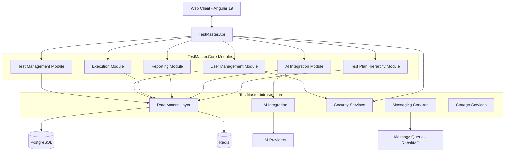
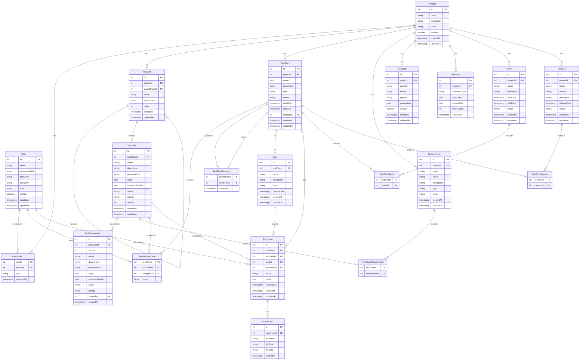

# GIẢI PHÁP KỸ THUẬT CẬP NHẬT - TESTMASTER

## 1. TỔNG QUAN GIẢI PHÁP KỸ THUẬT

### 1.1 Mục tiêu tài liệu

Tài liệu này cung cấp giải pháp kỹ thuật chi tiết để phát triển hệ thống TestMaster dựa trên Product Requirements Document (PRD) phiên bản 1.0, sử dụng kiến trúc Modular Monolithic thay vì Microservices. Tài liệu bao gồm thiết kế kiến trúc, đặc tả kỹ thuật, thiết kế database, API, tích hợp AI, và chiến lược triển khai.

### 1.2 Phạm vi kỹ thuật

Giải pháp kỹ thuật bao gồm:
- Kiến trúc modular monolithic
- Thiết kế database
- Thiết kế API
- Thiết kế frontend
- Tích hợp với LLM và AI Agents
- Cơ chế đảm bảo bảo mật và hiệu suất
- Chiến lược deployment và CI/CD

## 2. KIẾN TRÚC HỆ THỐNG

### 2.1 Kiến trúc tổng thể

TestMaster được thiết kế theo kiến trúc modular monolithic với các module logic rõ ràng, chạy trong cùng một quá trình nhưng có ranh giới rõ ràng giữa các module. Kiến trúc này cung cấp sự đơn giản trong phát triển và triển khai, đồng thời vẫn duy trì khả năng mở rộng và bảo trì.



### 2.2 Cấu trúc dự án

```
TestMaster/
|-- backend/
|   |-- src/
|   |   |-- TestMaster.Api/               # Web API layer
|   |   |   |-- Controllers/              # API controllers
|   |   |   |-- Middleware/               # Custom middleware
|   |   |   |-- Filters/                  # Action filters
|   |   |   |-- Program.cs                # Application entry point
|   |   |   `-- appsettings.json          # Configuration
|   |   |
|   |   |-- TestMaster.Core/              # Domain & business logic
|   |   |   |-- Models/                   # Domain models
|   |   |   |   |-- TestManagement/       # Test management models
|   |   |   |   |-- UserManagement/       # User management models
|   |   |   |   |-- Execution/            # Execution models
|   |   |   |   |-- Reporting/            # Reporting models
|   |   |   |   |-- AIIntegration/        # AI integration models
|   |   |   |   `-- TestPlanHierarchy/    # Test plan hierarchy models
|   |   |   |
|   |   |   |-- Interfaces/               # Interfaces for services and repositories
|   |   |   |-- Services/                 # Business logic services
|   |   |   |-- DTOs/                     # Data transfer objects
|   |   |   `-- Exceptions/               # Custom exceptions
|   |   |
|   |   `-- TestMaster.Infrastructure/    # Infrastructure concerns
|   |       |-- Data/                     # Database and ORM
|   |       |   |-- TestMasterDbContext.cs
|   |       |   |-- Configurations/       # Entity configurations
|   |       |   |-- Migrations/           # EF Core migrations
|   |       |   `-- Repositories/         # Repository implementations
|   |       |
|   |       |-- Services/                 # External service integrations
|   |       |   |-- LlmProviders/         # LLM provider implementations
|   |       |   |-- Cache/                # Cache service
|   |       |   |-- Messaging/            # Message queue services
|   |       |   `-- Storage/              # File storage services
|   |       |
|   |       |-- Security/                 # Security services
|   |       `-- Extensions/               # Extension methods
|   |
|   `-- tests/
|       |-- TestMaster.UnitTests/         # Unit tests
|       `-- TestMaster.IntegrationTests/  # Integration tests
|
|-- frontend/                             # Angular frontend
|   |-- src/
|   |   |-- app/
|   |   |   |-- core/                     # Core functionality
|   |   |   |-- shared/                   # Shared components
|   |   |   |-- features/                 # Feature modules
|   |   |   `-- layouts/                  # Layout components
|   |   |
|   |   |-- assets/                       # Static assets
|   |   `-- environments/                 # Environment configurations
|   |
|   |-- angular.json                      # Angular configuration
|   `-- package.json                      # NPM dependencies
|
|-- docker/                               # Docker configuration
|   |-- Dockerfile.backend                # Backend Dockerfile
|   |-- Dockerfile.frontend               # Frontend Dockerfile
|   `-- docker-compose.yml                # Docker Compose file
|
`-- TestMaster.sln                        # Solution file
```

### 2.3 Module Boundaries

Hệ thống được chia thành các module chức năng có ranh giới rõ ràng:

1. **Test Management Module**
   - Quản lý Test Project
   - Quản lý Test Suite
   - Quản lý Test Case
   - Phiên bản hóa Test Case
   - Import/Export Test Case

2. **User Management Module**
   - Quản lý người dùng và xác thực
   - Quản lý phân quyền và vai trò
   - Xác thực hai yếu tố (2FA)
   - Theo dõi hoạt động người dùng

3. **Execution Module**
   - Thực thi Test Case
   - Ghi nhận kết quả
   - Đính kèm ảnh chụp và ghi chú
   - Theo dõi thời gian thực thi

4. **Reporting Module**
   - Tạo báo cáo động
   - Dashboard visualization
   - Xuất báo cáo (PDF, Excel, HTML)
   - Phân tích xu hướng và chỉ số

5. **AI Integration Module**
   - Tích hợp với LLM providers
   - Xử lý và phân đoạn SRS
   - Quản lý các AI prompt
   - Tạo Test Case tự động

6. **Test Plan Hierarchy Module**
   - Quản lý cấu trúc phân cấp Test Plan
   - Liên kết giữa các cấp Test Plan
   - Tổng hợp và cập nhật trạng thái
   - Quản lý Sprint/Release

### 2.4 Communication Patterns

#### 2.4.1 Internal Communication
- Gọi phương thức trực tiếp giữa các service trong cùng một module
- Phụ thuộc tuần tự giữa các module thông qua interface
- Sử dụng event/listener pattern cho communication không đồng bộ trong module

#### 2.4.2 Asynchronous Processing
Sử dụng background processing cho các tác vụ dài:
- Hangfire cho background job processing
- Tạo Test Case tự động từ SRS (thời gian dài)
- Tổng hợp báo cáo phức tạp
- Xuất báo cáo lớn

#### 2.4.3 Event Types
```csharp
// Domain events
public class TestCaseCreatedEvent
{
    public int TestCaseId { get; set; }
    public int TestSuiteId { get; set; }
    public string Name { get; set; }
}

public class TestExecutionCompletedEvent
{
    public int ExecutionId { get; set; }
    public int TestCaseId { get; set; }
    public int TestPlanId { get; set; }
    public string Status { get; set; }
}

public class SrsAnalysisCompletedEvent
{
    public int ProjectId { get; set; }
    public List<int> GeneratedTestCaseIds { get; set; }
}
```

## 3. THIẾT KẾ DATABASE

### 3.1 Entity-Relationship Diagram (ERD)



### 3.2 Indexing Strategy

#### 3.2.1 Key Indexes
- Primary keys và Foreign keys sẽ có index tự động
- Compound indexes cho các trường tìm kiếm phổ biến:
  - `IX_TestCase_Name_Status`: Tối ưu tìm kiếm test case theo tên và trạng thái
  - `IX_Execution_TestPlanId_Status`: Tối ưu báo cáo thực thi theo test plan
  - `IX_TestPlanTestCase_TestPlanId_Status`: Tối ưu hiển thị trạng thái test plan
  - `IX_AiHistory_ProjectId_CreatedAt`: Tối ưu truy vấn lịch sử AI theo project

#### 3.2.2 Full-Text Search
- Postgre Full-Text Search cho tìm kiếm test case và requirement
- Tạo tsvector columns và GIN indexes:
  ```sql
  ALTER TABLE TestCase ADD COLUMN search_vector tsvector;
  CREATE INDEX idx_fts_test_case ON TestCase USING GIN (search_vector);
  
  CREATE FUNCTION test_case_search_trigger() RETURNS trigger AS $$
  BEGIN
    NEW.search_vector := 
      setweight(to_tsvector('english', coalesce(NEW.name, '')), 'A') ||
      setweight(to_tsvector('english', coalesce(NEW.description, '')), 'B') ||
      setweight(to_tsvector('english', coalesce(NEW.steps, '')), 'C') ||
      setweight(to_tsvector('english', coalesce(NEW.expectedResults, '')), 'D');
    RETURN NEW;
  END
  $$ LANGUAGE plpgsql;
  
  CREATE TRIGGER tsvector_update_trigger
  BEFORE INSERT OR UPDATE ON TestCase
  FOR EACH ROW EXECUTE FUNCTION test_case_search_trigger();
  ```

### 3.3 Caching Strategy

#### 3.3.1 Redis Cache Structure
- **Cache Keys:**
  - `project:{projectId}`: Thông tin project
  - `testplan:{planId}:summary`: Tóm tắt test plan
  - `testplan:{planId}:status`: Trạng thái test plan
  - `testcase:{caseId}`: Thông tin test case
  - `dashboard:{userId}:recent`: Dashboard gần đây theo người dùng
  - `sprint:{sprintId}:status`: Trạng thái sprint
  - `release:{releaseId}:status`: Trạng thái release

- **Cache TTL:**
  - Thông tin tĩnh: 1 ngày
  - Dashboard data: 15 phút
  - Trạng thái Test Plan: 5 phút

#### 3.3.2 Cache Invalidation
- **Event-based invalidation:**
  - Sau khi Execution hoàn thành, invalidate các cache liên quan
  - Sau khi Test Case thay đổi, invalidate các cache của Test Plan chứa nó

```csharp
// Sample code for cache invalidation
public async Task InvalidateTestPlanCache(int testPlanId)
{
    await _cacheService.RemoveAsync($"testplan:{testPlanId}:summary");
    await _cacheService.RemoveAsync($"testplan:{testPlanId}:status");
    
    // Get all parent test plans and invalidate
    var parentPlans = await _testPlanHierarchyRepository.GetParentPlans(testPlanId);
    foreach (var parentId in parentPlans)
    {
        await _cacheService.RemoveAsync($"testplan:{parentId}:summary");
        await _cacheService.RemoveAsync($"testplan:{parentId}:status");
    }
    
    // Publish event for dashboard cache invalidation
    _eventPublisher.Publish(new TestPlanChangedEvent { TestPlanId = testPlanId });
}
```

## 4. BUSINESS LOGIC LAYER (TESTMASTER.CORE)

### 4.1 Domain Models

```csharp
// Sample domain model
public class TestCase
{
    public int Id { get; set; }
    public int TestSuiteId { get; set; }
    public string Name { get; set; }
    public string Description { get; set; }
    public string Preconditions { get; set; }
    public string Steps { get; set; }
    public string ExpectedResults { get; set; }
    public string Status { get; set; }
    public string Priority { get; set; }
    public int Version { get; set; }
    public DateTime CreatedAt { get; set; }
    public DateTime UpdatedAt { get; set; }
    
    // Navigation properties
    public TestSuite TestSuite { get; set; }
    public ICollection<TestCaseVersion> Versions { get; set; }
    public ICollection<TestCaseRequirement> Requirements { get; set; }
    public ICollection<TestPlanTestCase> TestPlans { get; set; }
}
```

### 4.2 Interfaces

```csharp
// Repository interfaces
public interface IRepository<T> where T : class
{
    Task<T> GetByIdAsync(int id);
    Task<IEnumerable<T>> GetAllAsync();
    Task<IEnumerable<T>> FindAsync(Expression<Func<T, bool>> predicate);
    Task AddAsync(T entity);
    Task UpdateAsync(T entity);
    Task DeleteAsync(T entity);
}

public interface ITestCaseRepository : IRepository<TestCase>
{
    Task<IEnumerable<TestCase>> GetByTestSuiteIdAsync(int testSuiteId);
    Task<IEnumerable<TestCase>> SearchAsync(string keyword, int? projectId = null);
    Task<TestCaseVersion> GetVersionAsync(int testCaseId, int version);
    Task<IEnumerable<TestCaseVersion>> GetVersionHistoryAsync(int testCaseId);
}

// Service interfaces
public interface ITestCaseService
{
    Task<TestCaseDto> GetByIdAsync(int id);
    Task<IEnumerable<TestCaseDto>> GetByTestSuiteIdAsync(int testSuiteId);
    Task<IEnumerable<TestCaseDto>> SearchAsync(string keyword, int? projectId = null);
    Task<TestCaseDto> CreateAsync(CreateTestCaseDto createTestCaseDto);
    Task<TestCaseDto> UpdateAsync(int id, UpdateTestCaseDto updateTestCaseDto);
    Task DeleteAsync(int id);
    Task<TestCaseVersionDto> GetVersionAsync(int testCaseId, int version);
    Task<IEnumerable<TestCaseVersionDto>> GetVersionHistoryAsync(int testCaseId);
}
```

### 4.3 Services

```csharp
// Service implementation
public class TestCaseService : ITestCaseService
{
    private readonly ITestCaseRepository _testCaseRepository;
    private readonly IUnitOfWork _unitOfWork;
    private readonly IMapper _mapper;
    private readonly ICacheService _cacheService;
    private readonly IEventPublisher _eventPublisher;
    
    public TestCaseService(
        ITestCaseRepository testCaseRepository,
        IUnitOfWork unitOfWork,
        IMapper mapper,
        ICacheService cacheService,
        IEventPublisher eventPublisher)
    {
        _testCaseRepository = testCaseRepository;
        _unitOfWork = unitOfWork;
        _mapper = mapper;
        _cacheService = cacheService;
        _eventPublisher = eventPublisher;
    }
    
    public async Task<TestCaseDto> GetByIdAsync(int id)
    {
        return await _cacheService.GetOrCreateAsync(
            $"testcase:{id}",
            async () => 
            {
                var testCase = await _testCaseRepository.GetByIdAsync(id);
                if (testCase == null)
                    throw new NotFoundException($"TestCase with ID {id} not found");
                
                return _mapper.Map<TestCaseDto>(testCase);
            },
            TimeSpan.FromMinutes(30));
    }
    
    public async Task<IEnumerable<TestCaseDto>> GetByTestSuiteIdAsync(int testSuiteId)
    {
        var testCases = await _testCaseRepository.GetByTestSuiteIdAsync(testSuiteId);
        return _mapper.Map<IEnumerable<TestCaseDto>>(testCases);
    }
    
    public async Task<IEnumerable<TestCaseDto>> SearchAsync(string keyword, int? projectId = null)
    {
        var testCases = await _testCaseRepository.SearchAsync(keyword, projectId);
        return _mapper.Map<IEnumerable<TestCaseDto>>(testCases);
    }
    
    public async Task<TestCaseDto> CreateAsync(CreateTestCaseDto createTestCaseDto)
    {
        var testCase = _mapper.Map<TestCase>(createTestCaseDto);
        testCase.CreatedAt = DateTime.UtcNow;
        testCase.UpdatedAt = DateTime.UtcNow;
        testCase.Version = 1;
        testCase.Status = "Draft";
        
        await _testCaseRepository.AddAsync(testCase);
        await _unitOfWork.SaveChangesAsync();
        
        // Publish event
        _eventPublisher.Publish(new TestCaseCreatedEvent 
        { 
            TestCaseId = testCase.Id,
            TestSuiteId = testCase.TestSuiteId,
            Name = testCase.Name
        });
        
        return _mapper.Map<TestCaseDto>(testCase);
    }
    
    public async Task<TestCaseDto> UpdateAsync(int id, UpdateTestCaseDto updateTestCaseDto)
    {
        var testCase = await _testCaseRepository.GetByIdAsync(id);
        if (testCase == null)
            throw new NotFoundException($"TestCase with ID {id} not found");
        
        // Create a new version before updating
        var version = new TestCaseVersion
        {
            TestCaseId = testCase.Id,
            Version = testCase.Version,
            Name = testCase.Name,
            Description = testCase.Description,
            Preconditions = testCase.Preconditions,
            Steps = testCase.Steps,
            ExpectedResults = testCase.ExpectedResults,
            Status = testCase.Status,
            Priority = testCase.Priority,
            CreatedAt = DateTime.UtcNow
        };
        
        // Update test case
        _mapper.Map(updateTestCaseDto, testCase);
        testCase.UpdatedAt = DateTime.UtcNow;
        testCase.Version += 1;
        
        await _unitOfWork.SaveChangesAsync();
        
        // Invalidate cache
        await _cacheService.RemoveAsync($"testcase:{id}");
        
        // Publish event
        _eventPublisher.Publish(new TestCaseUpdatedEvent 
        { 
            TestCaseId = testCase.Id,
            NewVersion = testCase.Version
        });
        
        return _mapper.Map<TestCaseDto>(testCase);
    }
    
    public async Task DeleteAsync(int id)
    {
        var testCase = await _testCaseRepository.GetByIdAsync(id);
        if (testCase == null)
            throw new NotFoundException($"TestCase with ID {id} not found");
        
        await _testCaseRepository.DeleteAsync(testCase);
        await _unitOfWork.SaveChangesAsync();
        
        // Invalidate cache
        await _cacheService.RemoveAsync($"testcase:{id}");
        
        // Publish event
        _eventPublisher.Publish(new TestCaseDeletedEvent 
        { 
            TestCaseId = id
        });
    }
    
    public async Task<TestCaseVersionDto> GetVersionAsync(int testCaseId, int version)
    {
        var testCaseVersion = await _testCaseRepository.GetVersionAsync(testCaseId, version);
        if (testCaseVersion == null)
            throw new NotFoundException($"Version {version} of TestCase with ID {testCaseId} not found");
        
        return _mapper.Map<TestCaseVersionDto>(testCaseVersion);
    }
    
    public async Task<IEnumerable<TestCaseVersionDto>> GetVersionHistoryAsync(int testCaseId)
    {
        var versions = await _testCaseRepository.GetVersionHistoryAsync(testCaseId);
        return _mapper.Map<IEnumerable<TestCaseVersionDto>>(versions);
    }
}
```

### 4.4 Event Handling

```csharp
// Event publisher interface
public interface IEventPublisher
{
    void Publish<T>(T @event) where T : class;
}

// Event publisher implementation
public class EventPublisher : IEventPublisher
{
    private readonly IServiceProvider _serviceProvider;
    
    public EventPublisher(IServiceProvider serviceProvider)
    {
        _serviceProvider = serviceProvider;
    }
    
    public void Publish<T>(T @event) where T : class
    {
        using (var scope = _serviceProvider.CreateScope())
        {
            var handlers = scope.ServiceProvider.GetServices<IEventHandler<T>>();
            
            foreach (var handler in handlers)
            {
                try
                {
                    handler.Handle(@event);
                }
                catch (Exception ex)
                {
                    // Log error but don't stop other handlers
                    // In a production system, use proper logging
                    Console.WriteLine($"Error handling event {typeof(T).Name}: {ex}");
                }
            }
        }
    }
}

// Event handler interface
public interface IEventHandler<T> where T : class
{
    void Handle(T @event);
}

// Sample event handler
public class TestPlanStatusUpdateHandler : IEventHandler<TestExecutionCompletedEvent>
{
    private readonly ITestPlanStatusService _testPlanStatusService;
    
    public TestPlanStatusUpdateHandler(ITestPlanStatusService testPlanStatusService)
    {
        _testPlanStatusService = testPlanStatusService;
    }
    
    public void Handle(TestExecutionCompletedEvent @event)
    {
        // Update test plan status after execution
        _testPlanStatusService.UpdateTestPlanStatusAsync(@event.TestPlanId);
    }
}
```

## 5. API LAYER (TESTMASTER.API)

### 5.1 Controllers

```csharp
[ApiController]
[Route("api/v1/testcases")]
public class TestCasesController : ControllerBase
{
    private readonly ITestCaseService _testCaseService;
    private readonly ILogger<TestCasesController> _logger;
    
    public TestCasesController(
        ITestCaseService testCaseService,
        ILogger<TestCasesController> logger)
    {
        _testCaseService = testCaseService;
        _logger = logger;
    }
    
    [HttpGet("{id}")]
    [ProducesResponseType(StatusCodes.Status200OK)]
    [ProducesResponseType(StatusCodes.Status404NotFound)]
    public async Task<ActionResult<TestCaseDto>> GetById(int id)
    {
        try
        {
            var testCase = await _testCaseService.GetByIdAsync(id);
            return Ok(testCase);
        }
        catch (NotFoundException ex)
        {
            _logger.LogWarning(ex, "Test case not found: {Id}", id);
            return NotFound(new { message = ex.Message });
        }
    }
    
    [HttpGet]
    [ProducesResponseType(StatusCodes.Status200OK)]
    public async Task<ActionResult<IEnumerable<TestCaseDto>>> GetByTestSuite([FromQuery] int testSuiteId)
    {
        var testCases = await _testCaseService.GetByTestSuiteIdAsync(testSuiteId);
        return Ok(testCases);
    }
    
    [HttpGet("search")]
    [ProducesResponseType(StatusCodes.Status200OK)]
    public async Task<ActionResult<IEnumerable<TestCaseDto>>> Search(
        [FromQuery] string keyword, 
        [FromQuery] int? projectId = null)
    {
        var testCases = await _testCaseService.SearchAsync(keyword, projectId);
        return Ok(testCases);
    }
    
    [HttpPost]
    [ProducesResponseType(StatusCodes.Status201Created)]
    [ProducesResponseType(StatusCodes.Status400BadRequest)]
    public async Task<ActionResult<TestCaseDto>> Create([FromBody] CreateTestCaseDto createTestCaseDto)
    {
        if (!ModelState.IsValid)
            return BadRequest(ModelState);
        
        var testCase = await _testCaseService.CreateAsync(createTestCaseDto);
        return CreatedAtAction(nameof(GetById), new { id = testCase.Id }, testCase);
    }
    
    [HttpPut("{id}")]
    [ProducesResponseType(StatusCodes.Status200OK)]
    [ProducesResponseType(StatusCodes.Status404NotFound)]
    [ProducesResponseType(StatusCodes.Status400BadRequest)]
    public async Task<ActionResult<TestCaseDto>> Update(int id, [FromBody] UpdateTestCaseDto updateTestCaseDto)
    {
        if (!ModelState.IsValid)
            return BadRequest(ModelState);
        
        try
        {
            var testCase = await _testCaseService.UpdateAsync(id, updateTestCaseDto);
            return Ok(testCase);
        }
        catch (NotFoundException ex)
        {
            _logger.LogWarning(ex, "Test case not found: {Id}", id);
            return NotFound(new { message = ex.Message });
        }
    }
    
    [HttpDelete("{id}")]
    [ProducesResponseType(StatusCodes.Status204NoContent)]
    [ProducesResponseType(StatusCodes.Status404NotFound)]
    public async Task<ActionResult> Delete(int id)
    {
        try
        {
            await _testCaseService.DeleteAsync(id);
            return NoContent();
        }
        catch (NotFoundException ex)
        {
            _logger.LogWarning(ex, "Test case not found: {Id}", id);
            return NotFound(new { message = ex.Message });
        }
    }
    
    [HttpGet("{testCaseId}/versions/{version}")]
    [ProducesResponseType(StatusCodes.Status200OK)]
    [ProducesResponseType(StatusCodes.Status404NotFound)]
    public async Task<ActionResult<TestCaseVersionDto>> GetVersion(int testCaseId, int version)
    {
        try
        {
            var testCaseVersion = await _testCaseService.GetVersionAsync(testCaseId, version);
            return Ok(testCaseVersion);
        }
        catch (NotFoundException ex)
        {
            _logger.LogWarning(ex, "Test case version not found: {TestCaseId}, {Version}", testCaseId, version);
            return NotFound(new { message = ex.Message });
        }
    }
    
    [HttpGet("{testCaseId}/versions")]
    [ProducesResponseType(StatusCodes.Status200OK)]
    public async Task<ActionResult<IEnumerable<TestCaseVersionDto>>> GetVersionHistory(int testCaseId)
    {
        var versions = await _testCaseService.GetVersionHistoryAsync(testCaseId);
        return Ok(versions);
    }
}
```

### 5.2 API Routes

TestMaster API sẽ cung cấp các endpoint cho các module khác nhau như sau:

#### 5.2.1 Test Project Management
```
GET     /api/v1/projects
POST    /api/v1/projects
GET     /api/v1/projects/{id}
PUT     /api/v1/projects/{id}
DELETE  /api/v1/projects/{id}
```

#### 5.2.2 Test Suite Management
```
GET     /api/v1/projects/{projectId}/testsuites
POST    /api/v1/projects/{projectId}/testsuites
GET     /api/v1/testsuites/{id}
PUT     /api/v1/testsuites/{id}
DELETE  /api/v1/testsuites/{id}
```

#### 5.2.3 Test Case Management
```
GET     /api/v1/testsuites/{suiteId}/testcases
POST    /api/v1/testsuites/{suiteId}/testcases
GET     /api/v1/testcases/{id}
PUT     /api/v1/testcases/{id}
DELETE  /api/v1/testcases/{id}
GET     /api/v1/testcases/search
POST    /api/v1/testcases/import
GET     /api/v1/testcases/export
GET     /api/v1/testcases/{id}/versions
GET     /api/v1/testcases/{id}/versions/{versionId}
```

#### 5.2.4 User Management
```
POST    /api/v1/auth/register
POST    /api/v1/auth/login
POST    /api/v1/auth/logout
POST    /api/v1/auth/refresh-token
POST    /api/v1/auth/setup-2fa
POST    /api/v1/auth/verify-2fa

GET     /api/v1/users
POST    /api/v1/users
GET     /api/v1/users/{id}
PUT     /api/v1/users/{id}
DELETE  /api/v1/users/{id}
GET     /api/v1/users/{id}/activity
GET     /api/v1/roles
```

#### 5.2.5 Test Plan Management
```
GET     /api/v1/testplans
POST    /api/v1/testplans
GET     /api/v1/testplans/{id}
PUT     /api/v1/testplans/{id}
DELETE  /api/v1/testplans/{id}
GET     /api/v1/testplans/{id}/hierarchy
PUT     /api/v1/testplans/{id}/hierarchy
POST    /api/v1/testplans/{id}/link
DELETE  /api/v1/testplans/{id}/link/{linkedPlanId}
GET     /api/v1/testplans/{planId}/assignments
POST    /api/v1/testplans/{planId}/assignments
DELETE  /api/v1/testplans/{planId}/assignments/{assignmentId}
```

#### 5.2.6 Execution
```
POST    /api/v1/executions
GET     /api/v1/executions/{id}
PUT     /api/v1/executions/{id}
GET     /api/v1/testplans/{planId}/executions
POST    /api/v1/executions/{id}/attachments
GET     /api/v1/executions/{id}/attachments
DELETE  /api/v1/executions/{id}/attachments/{attachmentId}
```

#### 5.2.7 Reporting
```
GET     /api/v1/reports/testplans/{planId}/summary
GET     /api/v1/reports/testplans/{planId}/detailed
GET     /api/v1/reports/sprints/{sprintId}/summary
GET     /api/v1/reports/releases/{releaseId}/summary
GET     /api/v1/reports/custom
POST    /api/v1/reports/export
```

#### 5.2.8 AI Integration
```
POST    /api/v1/ai/analyze-srs
POST    /api/v1/ai/generate-testcases
GET     /api/v1/ai/providers
POST    /api/v1/ai/providers/{providerId}/test
GET     /api/v1/ai/prompts
POST    /api/v1/ai/prompts
PUT     /api/v1/ai/prompts/{id}
DELETE  /api/v1/ai/prompts/{id}
GET     /api/v1/ai/history
GET     /api/v1/ai/history/{id}
```

## 6. INFRASTRUCTURE LAYER (TESTMASTER.INFRASTRUCTURE)

### 6.1 Database Access

```csharp
// DbContext
public class TestMasterDbContext : DbContext
{
    public TestMasterDbContext(DbContextOptions<TestMasterDbContext> options)
        : base(options)
    {
    }
    
    public DbSet<User> Users { get; set; }
    public DbSet<Project> Projects { get; set; }
    public DbSet<TestSuite> TestSuites { get; set; }
    public DbSet<TestCase> TestCases { get; set; }
    public DbSet<TestCaseVersion> TestCaseVersions { get; set; }
    public DbSet<Requirement> Requirements { get; set; }
    public DbSet<TestCaseRequirement> TestCaseRequirements { get; set; }
    public DbSet<TestPlan> TestPlans { get; set; }
    public DbSet<TestPlanHierarchy> TestPlanHierarchies { get; set; }
    public DbSet<Build> Builds { get; set; }
    public DbSet<TestPlanTestCase> TestPlanTestCases { get; set; }
    public DbSet<Execution> Executions { get; set; }
    public DbSet<Attachment> Attachments { get; set; }
    public DbSet<AiConfig> AiConfigs { get; set; }
    public DbSet<AiHistory> AiHistories { get; set; }
    public DbSet<Sprint> Sprints { get; set; }
    public DbSet<Release> Releases { get; set; }
    public DbSet<UserProject> UserProjects { get; set; }
    
    protected override void OnModelCreating(ModelBuilder modelBuilder)
    {
        base.OnModelCreating(modelBuilder);
        
        // Apply entity configurations
        modelBuilder.ApplyConfigurationsFromAssembly(typeof(TestMasterDbContext).Assembly);
        
        // Define composite keys
        modelBuilder.Entity<TestCaseRequirement>()
            .HasKey(tcr => new { tcr.TestCaseId, tcr.RequirementId });
            
        modelBuilder.Entity<TestPlanHierarchy>()
            .HasKey(tph => new { tph.ParentPlanId, tph.ChildPlanId });
            
        modelBuilder.Entity<TestPlanTestCase>()
            .HasKey(tptc => new { tptc.TestPlanId, tptc.TestCaseId });
            
        modelBuilder.Entity<UserProject>()
            .HasKey(up => new { up.UserId, up.ProjectId });
    }
}

// Repository implementation
public class TestCaseRepository : ITestCaseRepository
{
    private readonly TestMasterDbContext _dbContext;
    
    public TestCaseRepository(TestMasterDbContext dbContext)
    {
        _dbContext = dbContext;
    }
    
    public async Task<TestCase> GetByIdAsync(int id)
    {
        return await _dbContext.TestCases
            .Include(tc => tc.TestSuite)
            .FirstOrDefaultAsync(tc => tc.Id == id);
    }
    
    public async Task<IEnumerable<TestCase>> GetAllAsync()
    {
        return await _dbContext.TestCases
            .Include(tc => tc.TestSuite)
            .ToListAsync();
    }
    
    public async Task<IEnumerable<TestCase>> FindAsync(Expression<Func<TestCase, bool>> predicate)
    {
        return await _dbContext.TestCases
            .Include(tc => tc.TestSuite)
            .Where(predicate)
            .ToListAsync();
    }
    
    public async Task<IEnumerable<TestCase>> GetByTestSuiteIdAsync(int testSuiteId)
    {
        return await _dbContext.TestCases
            .Include(tc => tc.TestSuite)
            .Where(tc => tc.TestSuiteId == testSuiteId)
            .OrderBy(tc => tc.Name)
            .ToListAsync();
    }
    
    public async Task<IEnumerable<TestCase>> SearchAsync(string keyword, int? projectId = null)
    {
        IQueryable<TestCase> query = _dbContext.TestCases
            .Include(tc => tc.TestSuite);
        
        if (!string.IsNullOrWhiteSpace(keyword))
        {
            query = query.Where(tc => EF.Functions.ToTsVector("english", 
                tc.Name + " " + tc.Description + " " + tc.Steps + " " + tc.ExpectedResults)
                .Matches(EF.Functions.ToTsQuery("english", keyword.Replace(" ", " & "))));
        }
        
        if (projectId.HasValue)
        {
            query = query.Where(tc => tc.TestSuite.ProjectId == projectId.Value);
        }
        
        return await query
            .OrderByDescending(tc => tc.UpdatedAt)
            .Take(100)
            .ToListAsync();
    }
    
    public async Task AddAsync(TestCase entity)
    {
        await _dbContext.TestCases.AddAsync(entity);
    }
    
    public Task UpdateAsync(TestCase entity)
    {
        _dbContext.Entry(entity).State = EntityState.Modified;
        return Task.CompletedTask;
    }
    
    public Task DeleteAsync(TestCase entity)
    {
        _dbContext.TestCases.Remove(entity);
        return Task.CompletedTask;
    }
    
    public async Task<TestCaseVersion> GetVersionAsync(int testCaseId, int version)
    {
        return await _dbContext.TestCaseVersions
            .FirstOrDefaultAsync(v => v.TestCaseId == testCaseId && v.Version == version);
    }
    
    public async Task<IEnumerable<TestCaseVersion>> GetVersionHistoryAsync(int testCaseId)
    {
        return await _dbContext.TestCaseVersions
            .Where(v => v.TestCaseId == testCaseId)
            .OrderByDescending(v => v.Version)
            .ToListAsync();
    }
}

// Unit of Work implementation
public interface IUnitOfWork
{
    Task SaveChangesAsync();
}

public class UnitOfWork : IUnitOfWork
{
    private readonly TestMasterDbContext _dbContext;
    
    public UnitOfWork(TestMasterDbContext dbContext)
    {
        _dbContext = dbContext;
    }
    
    public async Task SaveChangesAsync()
    {
        await _dbContext.SaveChangesAsync();
    }
}
```

### 6.2 Cache Service

```csharp
// Cache service interface
public interface ICacheService
{
    Task<T> GetOrCreateAsync<T>(string key, Func<Task<T>> factory, TimeSpan? expiration = null);
    Task<T> GetAsync<T>(string key);
    Task SetAsync<T>(string key, T value, TimeSpan? expiration = null);
    Task RemoveAsync(string key);
    Task RemoveByPatternAsync(string pattern);
}

// Redis implementation
public class RedisCacheService : ICacheService
{
    private readonly IConnectionMultiplexer _redis;
    private readonly ILogger<RedisCacheService> _logger;
    private readonly TimeSpan _defaultExpiration = TimeSpan.FromMinutes(30);
    
    public RedisCacheService(IConnectionMultiplexer redis, ILogger<RedisCacheService> logger)
    {
        _redis = redis;
        _logger = logger;
    }
    
    public async Task<T> GetOrCreateAsync<T>(string key, Func<Task<T>> factory, TimeSpan? expiration = null)
    {
        try
        {
            var db = _redis.GetDatabase();
            var cachedValue = await db.StringGetAsync(key);
            
            if (cachedValue.HasValue)
            {
                _logger.LogTrace("Cache hit for key: {Key}", key);
                return JsonSerializer.Deserialize<T>(cachedValue);
            }
            
            _logger.LogTrace("Cache miss for key: {Key}", key);
            var value = await factory();
            
            if (value != null)
            {
                await SetAsync(key, value, expiration);
            }
            
            return value;
        }
        catch (Exception ex)
        {
            _logger.LogWarning(ex, "Error accessing cache for key: {Key}, falling back to data source", key);
            return await factory();
        }
    }
    
    public async Task<T> GetAsync<T>(string key)
    {
        try
        {
            var db = _redis.GetDatabase();
            var cachedValue = await db.StringGetAsync(key);
            
            if (cachedValue.HasValue)
            {
                return JsonSerializer.Deserialize<T>(cachedValue);
            }
            
            return default;
        }
        catch (Exception ex)
        {
            _logger.LogWarning(ex, "Error getting value from cache for key: {Key}", key);
            return default;
        }
    }
    
    public async Task SetAsync<T>(string key, T value, TimeSpan? expiration = null)
    {
        try
        {
            var db = _redis.GetDatabase();
            var serialized = JsonSerializer.Serialize(value);
            await db.StringSetAsync(key, serialized, expiration ?? _defaultExpiration);
        }
        catch (Exception ex)
        {
            _logger.LogWarning(ex, "Error setting value in cache for key: {Key}", key);
        }
    }
    
    public async Task RemoveAsync(string key)
    {
        try
        {
            var db = _redis.GetDatabase();
            await db.KeyDeleteAsync(key);
        }
        catch (Exception ex)
        {
            _logger.LogWarning(ex, "Error removing key from cache: {Key}", key);
        }
    }
    
    public async Task RemoveByPatternAsync(string pattern)
    {
        try
        {
            var servers = _redis.GetEndPoints().Select(endpoint => _redis.GetServer(endpoint));
            
            foreach (var server in servers)
            {
                var keys = server.Keys(pattern: $"*{pattern}*");
                var db = _redis.GetDatabase();
                
                foreach (var key in keys)
                {
                    await db.KeyDeleteAsync(key);
                }
            }
        }
        catch (Exception ex)
        {
            _logger.LogWarning(ex, "Error removing keys by pattern: {Pattern}", pattern);
        }
    }
}
```

### 6.3 AI Integration

```csharp
// Interface for LLM providers
public interface ILlmProvider
{
    Task<LlmResponse> GenerateCompletionAsync(string prompt, LlmRequestOptions options);
    Task<bool> TestConnectionAsync();
    string ProviderName { get; }
    IEnumerable<string> AvailableModels { get; }
}

// Implementation for OpenAI
public class OpenAiProvider : ILlmProvider
{
    private readonly HttpClient _httpClient;
    private readonly string _apiKey;
    private readonly ILogger<OpenAiProvider> _logger;
    
    public OpenAiProvider(string apiKey, ILogger<OpenAiProvider> logger)
    {
        _apiKey = apiKey;
        _logger = logger;
        
        _httpClient = new HttpClient();
        _httpClient.DefaultRequestHeaders.Add("Authorization", $"Bearer {_apiKey}");
    }
    
    public string ProviderName => "OpenAI";
    
    public IEnumerable<string> AvailableModels => new[] { "gpt-4", "gpt-4-turbo", "gpt-3.5-turbo" };
    
    public async Task<LlmResponse> GenerateCompletionAsync(string prompt, LlmRequestOptions options)
    {
        try
        {
            var request = new HttpRequestMessage(HttpMethod.Post, "https://api.openai.com/v1/chat/completions");
            
            var requestBody = new
            {
                model = options.Model ?? "gpt-4",
                messages = new[]
                {
                    new { role = "system", content = options.SystemPrompt },
                    new { role = "user", content = prompt }
                },
                max_tokens = options.MaxTokens ?? 2000,
                temperature = options.Temperature ?? 0.2f
            };
            
            request.Content = new StringContent(
                JsonSerializer.Serialize(requestBody),
                Encoding.UTF8,
                "application/json");
                
            var response = await _httpClient.SendAsync(request);
            response.EnsureSuccessStatusCode();
            
            var responseBody = await response.Content.ReadAsStringAsync();
            var jsonResponse = JsonDocument.Parse(responseBody);
            
            var content = jsonResponse.RootElement
                .GetProperty("choices")[0]
                .GetProperty("message")
                .GetProperty("content")
                .GetString();
                
            var tokensUsed = jsonResponse.RootElement
                .GetProperty("usage")
                .GetProperty("total_tokens")
                .GetInt32();
                
            return new LlmResponse
            {
                Content = content,
                TokensUsed = tokensUsed,
                IsSuccessful = true
            };
        }
        catch (Exception ex)
        {
            _logger.LogError(ex, "Error generating completion from OpenAI");
            return new LlmResponse
            {
                IsSuccessful = false,
                ErrorMessage = ex.Message
            };
        }
    }
    
    public async Task<bool> TestConnectionAsync()
    {
        try
        {
            var request = new HttpRequestMessage(HttpMethod.Post, "https://api.openai.com/v1/chat/completions");
            
            var requestBody = new
            {
                model = "gpt-3.5-turbo",
                messages = new[]
                {
                    new { role = "user", content = "Hello" }
                },
                max_tokens = 5
            };
            
            request.Content = new StringContent(
                JsonSerializer.Serialize(requestBody),
                Encoding.UTF8,
                "application/json");
                
            var response = await _httpClient.SendAsync(request);
            return response.IsSuccessStatusCode;
        }
        catch
        {
            return false;
        }
    }
}

// Document processor
public class DocumentProcessor
{
    private readonly ILogger<DocumentProcessor> _logger;
    
    public DocumentProcessor(ILogger<DocumentProcessor> logger)
    {
        _logger = logger;
    }
    
    public async Task<List<DocumentChunk>> ProcessDocumentAsync(Stream documentStream, string fileType)
    {
        var content = await ExtractTextContent(documentStream, fileType);
        return ChunkDocument(content);
    }
    
    private async Task<string> ExtractTextContent(Stream documentStream, string fileType)
    {
        switch (fileType.ToLowerInvariant())
        {
            case "pdf":
                return await ExtractFromPdf(documentStream);
            case "docx":
                return await ExtractFromDocx(documentStream);
            case "markdown":
            case "md":
                return await ExtractFromMarkdown(documentStream);
            default:
                throw new NotSupportedException($"File type {fileType} is not supported");
        }
    }
    
    private List<DocumentChunk> ChunkDocument(string content)
    {
        var sections = new List<DocumentChunk>();
        
        // Identify document structure (headings, sections)
        var matches = Regex.Matches(content, @"(?<heading>#{1,6}\s+.+)|(?<section>.+?)(?=#{1,6}\s+|$)", RegexOptions.Singleline);
        
        string currentHeading = "";
        StringBuilder currentSection = new StringBuilder();
        
        foreach (Match match in matches)
        {
            if (match.Groups["heading"].Success)
            {
                // If we have content in currentSection, add it as a chunk
                if (currentSection.Length > 0)
                {
                    sections.Add(new DocumentChunk
                    {
                        Heading = currentHeading,
                        Content = currentSection.ToString().Trim(),
                        Type = "section"
                    });
                    currentSection.Clear();
                }
                
                currentHeading = match.Groups["heading"].Value.Trim();
                sections.Add(new DocumentChunk
                {
                    Heading = currentHeading,
                    Content = currentHeading,
                    Type = "heading"
                });
            }
            else if (match.Groups["section"].Success)
            {
                string sectionText = match.Groups["section"].Value.Trim();
                if (!string.IsNullOrWhiteSpace(sectionText))
                {
                    currentSection.AppendLine(sectionText);
                }
            }
        }
        
        // Add the last section if any
        if (currentSection.Length > 0)
        {
            sections.Add(new DocumentChunk
            {
                Heading = currentHeading,
                Content = currentSection.ToString().Trim(),
                Type = "section"
            });
        }
        
        // Further chunk large sections to respect token limits
        return ChunkLargeSections(sections);
    }
    
    private List<DocumentChunk> ChunkLargeSections(List<DocumentChunk> sections)
    {
        var result = new List<DocumentChunk>();
        
        foreach (var section in sections)
        {
            if (section.Type == "heading" || EstimateTokens(section.Content) <= 1500)
            {
                result.Add(section);
                continue;
            }
            
            // Split large sections into paragraphs
            var paragraphs = Regex.Split(section.Content, @"(?<=\n\n)").Where(p => !string.IsNullOrWhiteSpace(p)).ToList();
            
            StringBuilder currentChunk = new StringBuilder();
            int chunkIndex = 1;
            
            foreach (var paragraph in paragraphs)
            {
                if (EstimateTokens(currentChunk.ToString() + paragraph) > 1500)
                {
                    if (currentChunk.Length > 0)
                    {
                        result.Add(new DocumentChunk
                        {
                            Heading = $"{section.Heading} (Part {chunkIndex})",
                            Content = currentChunk.ToString().Trim(),
                            Type = "section"
                        });
                        chunkIndex++;
                        currentChunk.Clear();
                    }
                }
                
                currentChunk.AppendLine(paragraph);
            }
            
            if (currentChunk.Length > 0)
            {
                result.Add(new DocumentChunk
                {
                    Heading = chunkIndex > 1 ? $"{section.Heading} (Part {chunkIndex})" : section.Heading,
                    Content = currentChunk.ToString().Trim(),
                    Type = "section"
                });
            }
        }
        
        return result;
    }
    
    private int EstimateTokens(string text)
    {
        // Rough estimation: 1 token ≈ 4 characters for English text
        return text.Length / 4;
    }
}
```

## 7. FRONTEND DESIGN

### 7.1 Cấu trúc module Angular

```
app/
|-- core/                      # Core functionality
|   |-- auth/                  # Authentication
|   |-- http/                  # HTTP Interceptors
|   |-- guards/                # Route Guards
|   |-- services/              # Global Services
|   |-- models/                # Data Models
|   `-- store/                 # NgRx Store
|
|-- shared/                    # Shared components & utilities
|   |-- components/            # Reusable components
|   |-- directives/            # Custom directives
|   |-- pipes/                 # Custom pipes
|   `-- utils/                 # Utility functions
|
|-- features/                  # Feature modules
|   |-- dashboard/             # Dashboard feature
|   |-- projects/              # Projects management
|   |-- test-suites/           # Test Suites management
|   |-- test-cases/            # Test Cases management
|   |-- test-plans/            # Test Plans management
|   |-- executions/            # Test Executions
|   |-- reports/               # Reports & analytics
|   `-- ai-integration/        # AI Integration features
|
|-- layouts/                   # Layout components
|   |-- main-layout/           # Main application layout
|   |-- auth-layout/           # Authentication layout
|   `-- error-layout/          # Error pages layout
|
`-- app.module.ts              # Root module
```

### 7.2 State Management

```typescript
// app.state.ts
export interface AppState {
  auth: AuthState;
  projects: ProjectsState;
  testSuites: TestSuitesState;
  testCases: TestCasesState;
  testPlans: TestPlansState;
  executions: ExecutionsState;
  ai: AiState;
}

// test-plans.state.ts
export interface TestPlanState {
  testPlans: TestPlan[];
  selectedTestPlan: TestPlan | null;
  hierarchyView: TestPlanHierarchyNode[] | null;
  loading: boolean;
  loaded: boolean;
  error: string | null;
}

// test-plans.actions.ts
export const loadTestPlans = createAction('[Test Plans] Load Test Plans', props<{ projectId: number }>());
export const loadTestPlansSuccess = createAction('[Test Plans] Load Test Plans Success', props<{ testPlans: TestPlan[] }>());
export const loadTestPlansFailure = createAction('[Test Plans] Load Test Plans Failure', props<{ error: any }>());

export const loadTestPlanHierarchy = createAction('[Test Plans] Load Hierarchy', props<{ testPlanId: number }>());
export const loadTestPlanHierarchySuccess = createAction('[Test Plans] Load Hierarchy Success', props<{ hierarchy: TestPlanHierarchyNode[] }>());
export const loadTestPlanHierarchyFailure = createAction('[Test Plans] Load Hierarchy Failure', props<{ error: any }>());

// test-plans.reducer.ts
const initialState: TestPlanState = {
  testPlans: [],
  selectedTestPlan: null,
  hierarchyView: null,
  loading: false,
  loaded: false,
  error: null
};

export const testPlanReducer = createReducer(
  initialState,
  on(loadTestPlans, (state) => ({ ...state, loading: true, error: null })),
  on(loadTestPlansSuccess, (state, { testPlans }) => ({ ...state, testPlans, loading: false, loaded: true })),
  on(loadTestPlansFailure, (state, { error }) => ({ ...state, error, loading: false })),
  
  on(loadTestPlanHierarchy, (state) => ({ ...state, loading: true, error: null })),
  on(loadTestPlanHierarchySuccess, (state, { hierarchy }) => ({ ...state, hierarchyView: hierarchy, loading: false })),
  on(loadTestPlanHierarchyFailure, (state, { error }) => ({ ...state, error, loading: false }))
);

// test-plans.effects.ts
@Injectable()
export class TestPlanEffects {
  loadTestPlans$ = createEffect(() => this.actions$.pipe(
    ofType(loadTestPlans),
    switchMap(({ projectId }) => this.testPlanService.getTestPlans(projectId).pipe(
      map(testPlans => loadTestPlansSuccess({ testPlans })),
      catchError(error => of(loadTestPlansFailure({ error: error.message })))
    ))
  ));
  
  loadTestPlanHierarchy$ = createEffect(() => this.actions$.pipe(
    ofType(loadTestPlanHierarchy),
    switchMap(({ testPlanId }) => this.testPlanService.getHierarchy(testPlanId).pipe(
      map(hierarchy => loadTestPlanHierarchySuccess({ hierarchy })),
      catchError(error => of(loadTestPlanHierarchyFailure({ error: error.message })))
    ))
  ));
  
  constructor(
    private actions$: Actions,
    private testPlanService: TestPlanService
  ) {}
}
```

### 7.3 Routing Configuration

```typescript
// app-routing.module.ts
const routes: Routes = [
  {
    path: '',
    component: MainLayoutComponent,
    canActivate: [AuthGuard],
    children: [
      {
        path: 'dashboard',
        loadChildren: () => import('./features/dashboard/dashboard.module').then(m => m.DashboardModule)
      },
      {
        path: 'projects',
        loadChildren: () => import('./features/projects/projects.module').then(m => m.ProjectsModule)
      },
      {
        path: 'test-suites',
        loadChildren: () => import('./features/test-suites/test-suites.module').then(m => m.TestSuitesModule)
      },
      {
        path: 'test-cases',
        loadChildren: () => import('./features/test-cases/test-cases.module').then(m => m.TestCasesModule)
      },
      {
        path: 'test-plans',
        loadChildren: () => import('./features/test-plans/test-plans.module').then(m => m.TestPlansModule)
      },
      {
        path: 'executions',
        loadChildren: () => import('./features/executions/executions.module').then(m => m.ExecutionsModule)
      },
      {
        path: 'reports',
        loadChildren: () => import('./features/reports/reports.module').then(m => m.ReportsModule)
      },
      {
        path: 'ai-integration',
        loadChildren: () => import('./features/ai-integration/ai-integration.module').then(m => m.AiIntegrationModule)
      }
    ]
  },
  {
    path: 'auth',
    component: AuthLayoutComponent,
    loadChildren: () => import('./features/auth/auth.module').then(m => m.AuthModule)
  },
  {
    path: 'error',
    component: ErrorLayoutComponent,
    loadChildren: () => import('./features/error/error.module').then(m => m.ErrorModule)
  }
];
```

## 8. AUTHENTICATION AND AUTHORIZATION

### 8.1 JWT Authentication

```csharp
// AuthService
public class AuthService
{
    private readonly IUserRepository _userRepository;
    private readonly IPasswordHasher _passwordHasher;
    private readonly ITokenService _tokenService;
    private readonly ITwoFactorService _twoFactorService;
    private readonly ILogger<AuthService> _logger;
    
    public AuthService(
        IUserRepository userRepository,
        IPasswordHasher passwordHasher,
        ITokenService tokenService,
        ITwoFactorService twoFactorService,
        ILogger<AuthService> logger)
    {
        _userRepository = userRepository;
        _passwordHasher = passwordHasher;
        _tokenService = tokenService;
        _twoFactorService = twoFactorService;
        _logger = logger;
    }
    
    public async Task<LoginResultDto> LoginAsync(string email, string password)
    {
        var user = await _userRepository.GetByEmailAsync(email);
        if (user == null || !_passwordHasher.VerifyPassword(password, user.PasswordHash))
        {
            _logger.LogWarning("Failed login attempt for email: {Email}", email);
            throw new UnauthorizedException("Invalid email or password");
        }
        
        if (!user.IsActive)
        {
            _logger.LogWarning("Login attempt for inactive account: {Email}", email);
            throw new UnauthorizedException("Account is inactive");
        }
        
        var requires2FA = user.TwoFactorEnabled;
        if (requires2FA)
        {
            // Generate and send 2FA code
            await _twoFactorService.GenerateAndSendCodeAsync(user);
            
            return new LoginResultDto
            {
                RequiresTwoFactor = true,
                UserId = user.Id,
                TwoFactorToken = _twoFactorService.GenerateTwoFactorToken(user.Id)
            };
        }
        
        // Generate tokens
        var accessToken = _tokenService.GenerateAccessToken(user);
        var refreshToken = _tokenService.GenerateRefreshToken();
        
        // Save refresh token to database
        user.RefreshToken = refreshToken;
        user.RefreshTokenExpiryTime = DateTime.UtcNow.AddDays(7);
        await _userRepository.UpdateAsync(user);
        
        return new LoginResultDto
        {
            RequiresTwoFactor = false,
            UserId = user.Id,
            UserName = $"{user.FirstName} {user.LastName}",
            Email = user.Email,
            Role = user.Role,
            AccessToken = accessToken,
            RefreshToken = refreshToken
        };
    }
    
    // Other auth methods...
}
```

### 8.2 Role-based Authorization

```csharp
// Custom authorization requirement
public class RequireRoleRequirement : IAuthorizationRequirement
{
    public string Role { get; }
    
    public RequireRoleRequirement(string role)
    {
        Role = role;
    }
}

// Custom authorization handler
public class RequireRoleHandler : AuthorizationHandler<RequireRoleRequirement>
{
    private readonly IUserProjectRepository _userProjectRepository;
    
    public RequireRoleHandler(IUserProjectRepository userProjectRepository)
    {
        _userProjectRepository = userProjectRepository;
    }
    
    protected override async Task HandleRequirementAsync(
        AuthorizationHandlerContext context, 
        RequireRoleRequirement requirement)
    {
        if (!context.User.Identity.IsAuthenticated)
        {
            return;
        }
        
        // Global admin can access anything
        if (context.User.IsInRole("Admin"))
        {
            context.Succeed(requirement);
            return;
        }
        
        // For project-specific endpoints
        var routeData = context.Resource as RouteData;
        if (routeData != null && routeData.Values.ContainsKey("projectId"))
        {
            var projectId = Convert.ToInt32(routeData.Values["projectId"]);
            var userId = Convert.ToInt32(context.User.FindFirst(ClaimTypes.NameIdentifier).Value);
            
            var userProject = await _userProjectRepository.GetAsync(userId, projectId);
            if (userProject != null && IsRoleSufficient(userProject.Role, requirement.Role))
            {
                context.Succeed(requirement);
                return;
            }
        }
        
        // Check if user has the required global role
        if (context.User.IsInRole(requirement.Role))
        {
            context.Succeed(requirement);
        }
    }
    
    private bool IsRoleSufficient(string userRole, string requiredRole)
    {
        // Define role hierarchy
        var roleHierarchy = new Dictionary<string, int>
        {
            { "Admin", 100 },
            { "TestManager", 80 },
            { "TeamLead", 60 },
            { "Tester", 40 },
            { "Developer", 20 },
            { "Viewer", 10 }
        };
        
        return roleHierarchy.TryGetValue(userRole, out var userRoleValue) &&
               roleHierarchy.TryGetValue(requiredRole, out var requiredRoleValue) &&
               userRoleValue >= requiredRoleValue;
    }
}
```

### 8.3 API Authorization

```csharp
// Adding authorization policies
public static class AuthorizationServiceExtensions
{
    public static IServiceCollection AddCustomAuthorization(this IServiceCollection services)
    {
        services.AddAuthorization(options =>
        {
            options.AddPolicy("RequireAdmin", policy => 
                policy.Requirements.Add(new RequireRoleRequirement("Admin")));
                
            options.AddPolicy("RequireTestManager", policy => 
                policy.Requirements.Add(new RequireRoleRequirement("TestManager")));
                
            options.AddPolicy("RequireTester", policy => 
                policy.Requirements.Add(new RequireRoleRequirement("Tester")));
                
            options.AddPolicy("RequireViewer", policy => 
                policy.Requirements.Add(new RequireRoleRequirement("Viewer")));
        });
        
        services.AddScoped<IAuthorizationHandler, RequireRoleHandler>();
        
        return services;
    }
}

// Using authorization in controllers
[ApiController]
[Route("api/v1/testplans")]
public class TestPlansController : ControllerBase
{
    // GET /api/v1/testplans
    [HttpGet]
    [Authorize(Policy = "RequireViewer")]
    public async Task<ActionResult<IEnumerable<TestPlanDto>>> GetAll()
    {
        // Implementation...
    }
    
    // POST /api/v1/testplans
    [HttpPost]
    [Authorize(Policy = "RequireTestManager")]
    public async Task<ActionResult<TestPlanDto>> Create([FromBody] CreateTestPlanDto createTestPlanDto)
    {
        // Implementation...
    }
}
```

## 9. SECURITY IMPLEMENTATION

### 9.1 Data Encryption

```csharp
// Data encryption service
public interface IEncryptionService
{
    string Encrypt(string plainText);
    string Decrypt(string cipherText);
}

// Implementation
public class AesEncryptionService : IEncryptionService
{
    private readonly byte[] _key;
    private readonly byte[] _iv;
    
    public AesEncryptionService(IConfiguration configuration)
    {
        // In production, use a secure key vault
        var encryptionKey = configuration["Encryption:Key"];
        var encryptionIv = configuration["Encryption:IV"];
        
        if (string.IsNullOrEmpty(encryptionKey) || string.IsNullOrEmpty(encryptionIv))
        {
            throw new InvalidOperationException("Encryption key and IV must be configured");
        }
        
        _key = Convert.FromBase64String(encryptionKey);
        _iv = Convert.FromBase64String(encryptionIv);
    }
    
    public string Encrypt(string plainText)
    {
        if (string.IsNullOrEmpty(plainText))
            return plainText;
            
        using var aes = Aes.Create();
        aes.Key = _key;
        aes.IV = _iv;
        
        var encryptor = aes.CreateEncryptor(aes.Key, aes.IV);
        
        using var memoryStream = new MemoryStream();
        using var cryptoStream = new CryptoStream(memoryStream, encryptor, CryptoStreamMode.Write);
        using (var streamWriter = new StreamWriter(cryptoStream))
        {
            streamWriter.Write(plainText);
        }
        
        return Convert.ToBase64String(memoryStream.ToArray());
    }
    
    public string Decrypt(string cipherText)
    {
        if (string.IsNullOrEmpty(cipherText))
            return cipherText;
            
        var cipherBytes = Convert.FromBase64String(cipherText);
        
        using var aes = Aes.Create();
        aes.Key = _key;
        aes.IV = _iv;
        
        var decryptor = aes.CreateDecryptor(aes.Key, aes.IV);
        
        using var memoryStream = new MemoryStream(cipherBytes);
        using var cryptoStream = new CryptoStream(memoryStream, decryptor, CryptoStreamMode.Read);
        using var streamReader = new StreamReader(cryptoStream);
        
        return streamReader.ReadToEnd();
    }
}
```

### 9.2 Audit Logging

```csharp
// Audit log entity
public class AuditLog
{
    public int Id { get; set; }
    public int? UserId { get; set; }
    public string UserName { get; set; }
    public string Action { get; set; }
    public string EntityType { get; set; }
    public string EntityId { get; set; }
    public string Details { get; set; }
    public string IpAddress { get; set; }
    public DateTime Timestamp { get; set; }
}

// Audit log service
public interface IAuditLogService
{
    Task LogAsync(
        string action, 
        string entityType, 
        string entityId, 
        object details = null);
}

// Implementation
public class AuditLogService : IAuditLogService
{
    private readonly IHttpContextAccessor _httpContextAccessor;
    private readonly TestMasterDbContext _dbContext;
    private readonly ILogger<AuditLogService> _logger;
    
    public AuditLogService(
        IHttpContextAccessor httpContextAccessor,
        TestMasterDbContext dbContext,
        ILogger<AuditLogService> logger)
    {
        _httpContextAccessor = httpContextAccessor;
        _dbContext = dbContext;
        _logger = logger;
    }
    
    public async Task LogAsync(
        string action, 
        string entityType, 
        string entityId, 
        object details = null)
    {
        try
        {
            var httpContext = _httpContextAccessor.HttpContext;
            var userId = httpContext?.User?.FindFirst(ClaimTypes.NameIdentifier)?.Value;
            var userName = httpContext?.User?.FindFirst(ClaimTypes.Name)?.Value;
            var ipAddress = httpContext?.Connection?.RemoteIpAddress?.ToString();
            
            var auditLog = new AuditLog
            {
                UserId = userId != null ? int.Parse(userId) : null,
                UserName = userName ?? "System",
                Action = action,
                EntityType = entityType,
                EntityId = entityId,
                Details = details != null ? JsonSerializer.Serialize(details) : null,
                IpAddress = ipAddress ?? "Unknown",
                Timestamp = DateTime.UtcNow
            };
            
            await _dbContext.AuditLogs.AddAsync(auditLog);
            await _dbContext.SaveChangesAsync();
        }
        catch (Exception ex)
        {
            // Audit logging should not affect the main application flow
            _logger.LogError(ex, "Error creating audit log for {Action} on {EntityType} {EntityId}", 
                action, entityType, entityId);
        }
    }
}
```

### 9.3 Xử lý dữ liệu nhạy cảm khi gọi LLM

```csharp
public class DataSanitizerService
{
    private readonly ILogger<DataSanitizerService> _logger;
    private readonly IConfiguration _configuration;
    
    // Patterns đánh dấu thông tin nhạy cảm
    private static readonly Regex EmailPattern = new Regex(@"[a-zA-Z0-9._%+-]+@[a-zA-Z0-9.-]+\.[a-zA-Z]{2,}", RegexOptions.Compiled);
    private static readonly Regex PhonePattern = new Regex(@"\+?\d{1,4}?[-.\s]?\(?\d{1,3}?\)?[-.\s]?\d{1,4}[-.\s]?\d{1,4}[-.\s]?\d{1,9}", RegexOptions.Compiled);
    private static readonly Regex SsnPattern = new Regex(@"\d{3}-\d{2}-\d{4}", RegexOptions.Compiled);
    private static readonly Regex ApiKeyPattern = new Regex(@"[a-zA-Z0-9_\-]{32,}", RegexOptions.Compiled);
    
    public DataSanitizerService(ILogger<DataSanitizerService> logger, IConfiguration configuration)
    {
        _logger = logger;
        _configuration = configuration;
    }
    
    public string SanitizeForLlm(string input)
    {
        if (string.IsNullOrEmpty(input))
            return input;
            
        var sensitiveFields = _configuration.GetSection("Security:SensitiveFields")
            .Get<string[]>() ?? Array.Empty<string>();
            
        var sensitivePatterns = _configuration.GetSection("Security:SensitivePatterns")
            .Get<string[]>() ?? Array.Empty<string>();
            
        // Apply custom sensitive field names
        foreach (var field in sensitiveFields)
        {
            var pattern = new Regex($@"({field})[:\s]*[""']?([^""'\s,;]+)[""']?", RegexOptions.IgnoreCase);
            input = pattern.Replace(input, m => $"{m.Groups[1].Value}: [REDACTED]");
        }
        
        // Apply custom sensitive patterns
        foreach (var patternStr in sensitivePatterns)
        {
            var pattern = new Regex(patternStr, RegexOptions.IgnoreCase);
            input = pattern.Replace(input, "[REDACTED]");
        }
        
        // Apply standard patterns
        input = EmailPattern.Replace(input, "[EMAIL]");
        input = PhonePattern.Replace(input, "[PHONE]");
        input = SsnPattern.Replace(input, "[SSN]");
        input = ApiKeyPattern.Replace(input, "[API_KEY]");
        
        return input;
    }
    
    public async Task<Stream> SanitizeSrsDocumentAsync(Stream documentStream, string fileType)
    {
        // Read document content
        string content;
        
        using (var reader = new StreamReader(documentStream, leaveOpen: true))
        {
            content = await reader.ReadToEndAsync();
        }
        
        // Sanitize content
        var sanitizedContent = SanitizeForLlm(content);
        
        // Create new stream
        var sanitizedStream = new MemoryStream();
        using (var writer = new StreamWriter(sanitizedStream, leaveOpen: true))
        {
            await writer.WriteAsync(sanitizedContent);
            await writer.FlushAsync();
        }
        
        sanitizedStream.Position = 0;
        return sanitizedStream;
    }
}
```

## 10. DEPLOYMENT & CI/CD

### 10.1 Docker Containerization

#### 10.1.1 Dockerfile cho Backend

```dockerfile
# Dockerfile.backend
FROM mcr.microsoft.com/dotnet/aspnet:8.0 AS base
WORKDIR /app
EXPOSE 80
EXPOSE 443

FROM mcr.microsoft.com/dotnet/sdk:8.0 AS build
WORKDIR /src
COPY ["backend/src/TestMaster.Api/TestMaster.Api.csproj", "backend/src/TestMaster.Api/"]
COPY ["backend/src/TestMaster.Core/TestMaster.Core.csproj", "backend/src/TestMaster.Core/"]
COPY ["backend/src/TestMaster.Infrastructure/TestMaster.Infrastructure.csproj", "backend/src/TestMaster.Infrastructure/"]
RUN dotnet restore "backend/src/TestMaster.Api/TestMaster.Api.csproj"
COPY . .
WORKDIR "/src/backend/src/TestMaster.Api"
RUN dotnet build "TestMaster.Api.csproj" -c Release -o /app/build

FROM build AS publish
RUN dotnet publish "TestMaster.Api.csproj" -c Release -o /app/publish

FROM base AS final
WORKDIR /app
COPY --from=publish /app/publish .
ENTRYPOINT ["dotnet", "TestMaster.Api.dll"]
```

#### 10.1.2 Docker Compose

```yaml
# docker-compose.yml
version: '3.8'

services:
  postgres:
    image: postgres:14
    environment:
      - POSTGRES_USER=testmaster
      - POSTGRES_PASSWORD=TestMaster#2025
      - POSTGRES_DB=testmaster
    volumes:
      - postgres-data:/var/lib/postgresql/data
    ports:
      - "5432:5432"
    healthcheck:
      test: ["CMD-SHELL", "pg_isready -U testmaster"]
      interval: 10s
      timeout: 5s
      retries: 5

  redis:
    image: redis:7
    ports:
      - "6379:6379"
    volumes:
      - redis-data:/data
    healthcheck:
      test: ["CMD", "redis-cli", "ping"]
      interval: 10s
      timeout: 5s
      retries: 5

  rabbitmq:
    image: rabbitmq:3-management
    ports:
      - "5672:5672"
      - "15672:15672"
    environment:
      - RABBITMQ_DEFAULT_USER=testmaster
      - RABBITMQ_DEFAULT_PASS=TestMaster#2025
    volumes:
      - rabbitmq-data:/var/lib/rabbitmq
    healthcheck:
      test: ["CMD", "rabbitmqctl", "status"]
      interval: 10s
      timeout: 5s
      retries: 5

  api:
    build:
      context: .
      dockerfile: docker/Dockerfile.backend
    ports:
      - "5000:80"
      - "5001:443"
    environment:
      - ASPNETCORE_ENVIRONMENT=Development
      - ConnectionStrings__DefaultConnection=Host=postgres;Database=testmaster;Username=testmaster;Password=TestMaster#2025
      - Redis__ConnectionString=redis:6379
      - RabbitMQ__HostName=rabbitmq
      - RabbitMQ__UserName=testmaster
      - RabbitMQ__Password=TestMaster#2025
    depends_on:
      postgres:
        condition: service_healthy
      redis:
        condition: service_healthy
      rabbitmq:
        condition: service_healthy
  
  frontend:
    build:
      context: .
      dockerfile: docker/Dockerfile.frontend
    ports:
      - "4200:80"
    depends_on:
      - api

volumes:
  postgres-data:
  redis-data:
  rabbitmq-data:
```

### 10.2 CI/CD Pipeline (GitHub Actions)

```yaml
# .github/workflows/ci-cd.yml
name: CI/CD Pipeline

on:
  push:
    branches: [ main, develop ]
  pull_request:
    branches: [ main, develop ]

jobs:
  build:
    runs-on: ubuntu-latest
    
    steps:
    - uses: actions/checkout@v2
    
    - name: Setup .NET
      uses: actions/setup-dotnet@v1
      with:
        dotnet-version: 8.0.x
    
    - name: Restore dependencies
      run: dotnet restore backend/TestMaster.sln
    
    - name: Build
      run: dotnet build backend/TestMaster.sln --no-restore --configuration Release
    
    - name: Test
      run: dotnet test backend/tests/TestMaster.UnitTests/TestMaster.UnitTests.csproj --no-build --verbosity normal
    
    - name: Setup Node.js
      uses: actions/setup-node@v2
      with:
        node-version: '18.x'
    
    - name: Angular - Install dependencies
      run: cd frontend && npm ci
    
    - name: Angular - Lint
      run: cd frontend && npm run lint
    
    - name: Angular - Build
      run: cd frontend && npm run build -- --configuration production
    
    - name: Angular - Test
      run: cd frontend && npm run test -- --browsers=ChromeHeadless --watch=false
    
    - name: Upload artifacts
      uses: actions/upload-artifact@v2
      with:
        name: build-output
        path: |
          backend/src/TestMaster.Api/bin/Release/net8.0/
          frontend/dist/

  deploy-development:
    needs: build
    if: github.ref == 'refs/heads/develop'
    runs-on: ubuntu-latest
    environment: development
    
    steps:
    - uses: actions/checkout@v2
    
    - name: Download artifacts
      uses: actions/download-artifact@v2
      with:
        name: build-output
    
    - name: Setup Docker Buildx
      uses: docker/setup-buildx-action@v1
    
    - name: Login to DockerHub
      uses: docker/login-action@v1
      with:
        username: ${{ secrets.DOCKERHUB_USERNAME }}
        password: ${{ secrets.DOCKERHUB_TOKEN }}
    
    - name: Build and push backend image
      uses: docker/build-push-action@v2
      with:
        context: .
        file: docker/Dockerfile.backend
        push: true
        tags: username/testmaster-backend:develop
    
    - name: Build and push frontend image
      uses: docker/build-push-action@v2
      with:
        context: .
        file: docker/Dockerfile.frontend
        push: true
        tags: username/testmaster-frontend:develop
    
    - name: Deploy to development server
      # Deploy to development server using SSH or other method
      run: echo "Deploying to development server"

  deploy-production:
    needs: build
    if: github.ref == 'refs/heads/main'
    runs-on: ubuntu-latest
    environment: production
    
    steps:
    # Similar to development deployment, but for production
    - run: echo "Deploying to production server"
```

## 11. HIỆU SUẤT VÀ TĂNG TRƯỞNG

### 11.1 Caching Strategy

- **Two-level caching:**
  - In-memory caching cho dữ liệu truy cập thường xuyên và ít thay đổi
  - Redis caching cho dữ liệu chia sẻ giữa các instance

- **Cache invalidation:**
  - Event-based invalidation thông qua publisher/subscriber pattern
  - Time-based expiration cho dữ liệu ít truy cập

### 11.2 Horizontal Scaling

- **Web Layer (Backend API):**
  - Scale out qua nhiều instance
  - Load balancing với Round Robin hoặc Least Connection
  - Sticky sessions cho các hoạt động dài

- **Database Layer:**
  - Read replicas cho queries phức tạp
  - Connection pooling để tối ưu hóa connections

### 11.3 Performance Considerations

- **API Pagination:**
  - Tất cả API trả về tập dữ liệu lớn sẽ hỗ trợ pagination
  - Max result size được giới hạn để tránh overload

- **Background Processing:**
  - Sử dụng Hangfire cho các tác vụ dài và nặng
  - Asynchronous processing cho tác vụ tạo test case từ LLM

## 12. KẾT LUẬN

### 12.1 Tổng kết giải pháp

TestMaster là một hệ thống quản lý test case toàn diện được phát triển với kiến trúc modular monolithic, cho phép dễ dàng phát triển, triển khai và bảo trì, đồng thời vẫn duy trì khả năng mở rộng. Hệ thống cung cấp các tính năng quản lý test plan phân cấp mạnh mẽ và tích hợp AI để tự động hóa việc tạo test case từ tài liệu SRS.

Giải pháp kỹ thuật sử dụng các công nghệ tiên tiến như:
- Angular 19 với TypeScript và NgRx cho frontend
- C# .NET Core 8.0 cho backend
- PostgreSQL và Redis cho lưu trữ dữ liệu
- Hangfire cho background processing
- Docker và GitHub Actions cho CI/CD
- Tích hợp API với OpenAI GPT và Anthropic Claude

Hệ thống được thiết kế với khả năng mở rộng cao, hiệu suất tốt, và bảo mật nghiêm ngặt, phù hợp với môi trường doanh nghiệp.

### 12.2 Rủi ro kỹ thuật và giảm thiểu

1. **Hiệu suất LLM:**
   - **Rủi ro:** Thời gian phản hồi từ LLM có thể không ổn định, ảnh hư### 12.2 Rủi ro kỹ thuật và giảm thiểu (tiếp theo)

1. **Hiệu suất LLM:**
   - **Rủi ro:** Thời gian phản hồi từ LLM có thể không ổn định, ảnh hưởng đến UX
   - **Giảm thiểu:** Xử lý bất đồng bộ, hiển thị trạng thái quá trình, caching kết quả, và setup timeout hợp lý

2. **Bảo mật dữ liệu:**
   - **Rủi ro:** Rò rỉ thông tin nhạy cảm khi gửi đến LLM
   - **Giảm thiểu:** Data sanitization, kiểm soát quyền truy cập, và audit logging

3. **Độ chính xác của test case tự động:**
   - **Rủi ro:** Test case được tạo ra có thể không đủ chất lượng
   - **Giảm thiểu:** Prompt engineering, xác thực người dùng, và cải tiến liên tục các prompt template

4. **Khả năng mở rộng:**
   - **Rủi ro:** Khó mở rộng khi số lượng dữ liệu tăng
   - **Giảm thiểu:** Thiết kế modular với ranh giới rõ ràng, database sharding, và horizontal scaling cho web tier

5. **Phụ thuộc Service:**
   - **Rủi ro:** Downtime của AI service có thể ảnh hưởng đến các chức năng khác
   - **Giảm thiểu:** Circuit breaker pattern, fallback mechanisms, và service isolation

### 12.3 Lợi ích của kiến trúc modular monolithic

1. **Đơn giản hóa phát triển:** Các nhóm phát triển làm việc trong cùng một codebase, giúp gỡ lỗi và triển khai dễ dàng hơn.

2. **Deployment đơn giản:** Triển khai một ứng dụng duy nhất thay vì nhiều microservices phức tạp.

3. **Giảm overhead:** Không có network latency giữa các service, giảm bớt độ phức tạp về infrastructure và operational costs.

4. **Khả năng mở rộng theo module:** Thiết kế các module với ranh giới rõ ràng, dễ dàng tách thành microservices nếu cần trong tương lai.

5. **Shared resources:** Chia sẻ cache, connection pools và các resource khác một cách hiệu quả.

### 12.4 Roadmap phát triển tương lai

1. **Phase 1 (Q3 2025):** Tích hợp và cải tiến AI
   - Fine-tuning LLM cho test case generation
   - Phân tích kết quả kiểm thử bằng AI
   - Dự đoán nguy cơ thất bại và đề xuất test case

2. **Phase 2 (Q4 2025):** Tự động hóa nâng cao
   - Tạo script kiểm thử tự động từ test case
   - Tích hợp với CI/CD pipeline
   - Phát hiện trùng lặp và tối ưu hóa test case

3. **Phase 3 (Q1 2026):** Analytics và Insights
   - Trí tuệ kinh doanh và phân tích xu hướng
   - Dự báo hiệu suất kiểm thử
   - Phân tích nguyên nhân gốc rễ

4. **Phase 4 (Q2 2026):** Enterprise Integration
   - Tích hợp với các công cụ quản lý dự án phổ biến
   - SSO và MFA nâng cao
   - Multi-tenant architecture

5. **Phase 5 (Q3 2026):** Chuyển đổi sang microservices (nếu cần)
   - Tách các module thành microservices độc lập
   - Triển khai service mesh
   - Nâng cấp CI/CD pipeline cho các microservices

### 12.5 Khuyến nghị triển khai

1. **Phương pháp Incremental:**
   - Phát triển các tính năng chính (MVP) trước
   - Kiểm thử kỹ lưỡng trước khi thêm các tính năng mở rộng
   - Thu thập phản hồi từ người dùng sớm trong quá trình phát triển

2. **Monitoring và Logging:**
   - Triển khai monitoring tools từ giai đoạn đầu
   - Theo dõi hiệu suất của hệ thống và API LLM
   - Logging chi tiết các lỗi và hành vi bất thường

3. **DevOps và Automation:**
   - Triển khai CI/CD từ giai đoạn đầu
   - Tự động hóa quy trình testing
   - Tự động hóa deployment process

4. **Documentation:**
   - Duy trì tài liệu kỹ thuật cập nhật
   - Cung cấp API documentation đầy đủ
   - Tạo hướng dẫn người dùng chi tiết

---

*Tài liệu này thể hiện giải pháp kỹ thuật chi tiết cho việc phát triển TestMaster dựa trên Product Requirements Document phiên bản 1.0, với kiến trúc modular monolithic thay vì microservices. Các kế hoạch triển khai, công nghệ, và chi tiết kỹ thuật có thể được điều chỉnh theo phản hồi từ stakeholders.*